# Kiến trúc Hệ thống Reporting — NewSense Reporting App

## Tổng quan

Tài liệu này mô tả kiến trúc của **NewSense Reporting** — một web application độc lập dùng để tạo báo cáo từ dữ liệu ThingsBoard CE. Ứng dụng được nhúng vào ThingsBoard Dashboard qua **Custom HTML Widget (iframe)**, dùng chung xác thực với ThingsBoard.

**Luồng cốt lõi:** Người dùng chọn danh sách dashboard → ứng dụng quét từng dashboard → mỗi dashboard thành 1 mục lớn → trong mỗi mục, vẽ lại từng widget từ dữ liệu fetch qua TB REST API → sắp xếp theo template → xuất PDF.

---

## 1. Yêu cầu hệ thống

### 1.1 Yêu cầu chức năng (Functional Requirements)

| ID | Chức năng | Mô tả |
|---|---|---|
| FR-01 | Quản lý Template | Tạo, chỉnh sửa, xóa, xem danh sách template báo cáo |
| FR-02 | Template Builder | Giao diện WYSIWYG drag & drop để thiết kế layout báo cáo |
| FR-03 | Chọn Dashboard | Người dùng chọn và sắp xếp thứ tự các dashboard đưa vào báo cáo |
| FR-04 | Publish Template | Publish template để sẵn sàng sử dụng; template ở trạng thái Draft chưa được chọn để export |
| FR-05 | Export thủ công | Người dùng chọn 1 hoặc nhiều template qua checkbox, export tất cả cùng lúc với khoảng thời gian tùy chọn |
| FR-06 | Auto Export lịch | Tự động export theo preset Daily / Weekly / Monthly với danh sách template được cấu hình sẵn |
| FR-07 | Cấu hình Recipients | Mỗi schedule có danh sách email nhận báo cáo riêng |
| FR-08 | Report Viewer | Xem báo cáo online trực tiếp trong trình duyệt (PDF inline) |
| FR-09 | Download PDF | Tải xuống từng báo cáo hoặc tải cả batch dưới dạng ZIP |
| FR-10 | Lịch sử báo cáo | Xem lịch sử báo cáo với 2 chế độ filter: theo lần xuất (batch) và theo template |
| FR-11 | Xác thực TB | Không có login riêng — dùng JWT token từ ThingsBoard qua `postMessage` |
| FR-12 | Multi-tenant | Dữ liệu template và báo cáo hoàn toàn tách biệt giữa các tenant |

### 1.2 Yêu cầu phi chức năng (Non-functional Requirements)

| ID | Yêu cầu | Chỉ số mục tiêu |
|---|---|---|
| NFR-01 | **Hiệu năng export** | PDF với 5 dashboard (~20 widget) hoàn thành trong ≤ 60s |
| NFR-02 | **Bảo mật token** | JWT token chỉ lưu in-memory, không persist vào localStorage/cookie |
| NFR-03 | **Mã hoá credentials** | Service account credentials mã hoá AES-256 trước khi lưu DB |
| NFR-04 | **File access** | PDF phục vụ qua MinIO presigned URL — TTL 15 phút |
| NFR-05 | **Cô lập tenant** | Row-level filtering theo `tenant_id` trên toàn bộ query DB |
| NFR-06 | **Retry khi lỗi** | BullMQ tự retry job tối đa 3 lần khi TB API timeout |
| NFR-07 | **Không phụ thuộc TB PE** | Toàn bộ chức năng chỉ dùng ThingsBoard CE REST API — không cần PE license |

---

## 2. Nguyên tắc thiết kế

- **Không sửa ThingsBoard CE source code** — chỉ dùng REST API và iframe embedding
- **Dùng chung auth với TB** — JWT token từ TB được truyền sang Reporting App qua `postMessage`, không có hệ thống đăng nhập riêng
- **Dashboard-driven data** — cấu hình widget (aliases, timewindow, data keys) lấy từ TB dashboard config, không cần người dùng cấu hình lại
- **Template-driven layout** — template định nghĩa cách sắp xếp, còn data lấy từ dashboard
- **Data-driven rendering** — fetch raw data từ TB API, tự render chart/table (không screenshot)
- **Export manual + auto** — hỗ trợ xuất thủ công và lên lịch tự động theo ngày/tuần/tháng

---

## 3. Kiến trúc tổng thể

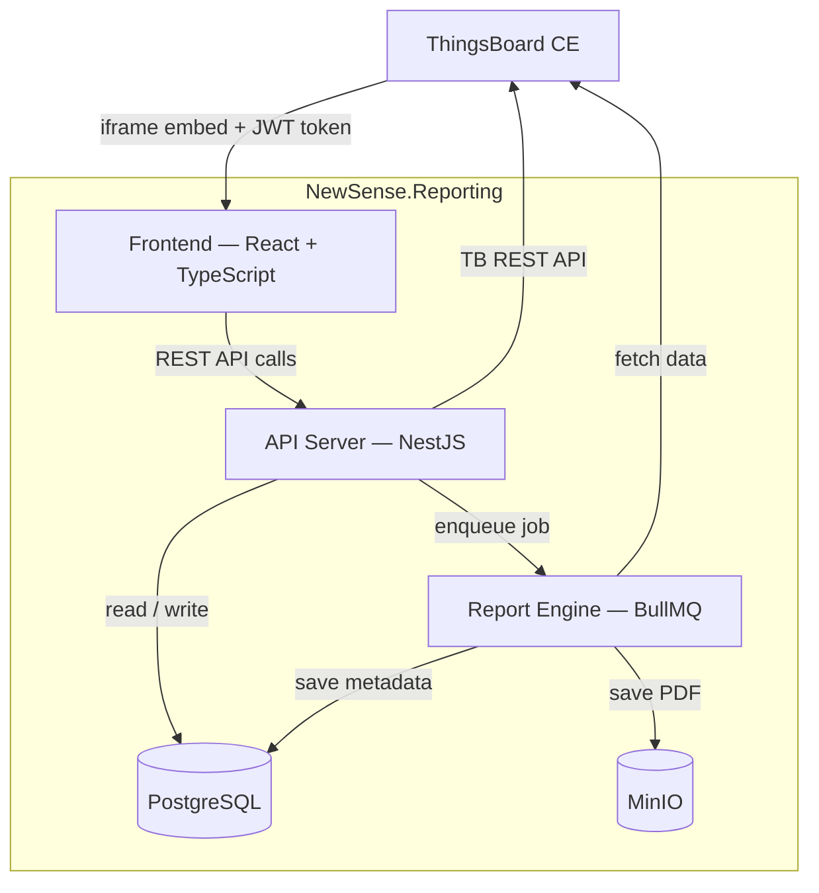

---

## 4. Tích hợp ThingsBoard — Auth & Embedding

### 4.1 Cơ chế nhúng iframe

```html
<!-- Custom HTML Widget trong ThingsBoard Dashboard -->
<div style="width:100%; height:100%;">
  <iframe id="reporting-frame"
    src="http://reporting-host:3100/embed"
    style="width:100%; height:100%; border:none;"
    allow="downloads">
  </iframe>
</div>

<script>
  self.onInit = function() {
    const token    = self.ctx.$scope.$root.authService.getJwtToken();
    const tbHost   = window.location.origin;
    const frame    = document.getElementById('reporting-frame');

    frame.onload = function() {
      frame.contentWindow.postMessage(
        { type: 'TB_AUTH', token, tbHost },
        '*'
      );
    };
  };
</script>
```

### 4.2 Luồng xác thực

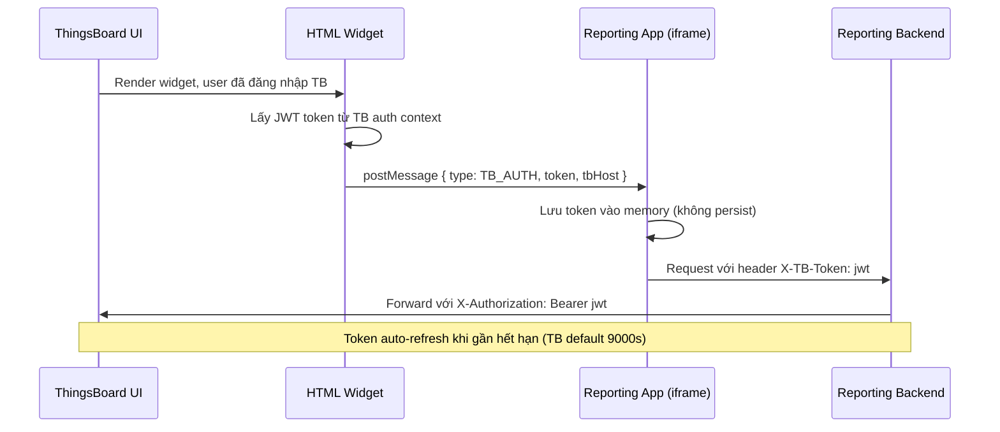

> **Không có login riêng:** Reporting App hoàn toàn phụ thuộc vào session của ThingsBoard. Khi người dùng logout khỏi TB thì Reporting App cũng mất quyền truy cập.

---

## 5. Template System

### 5.1 Khái niệm

| Khái niệm | Mô tả |
|---|---|
| **Template** | Định nghĩa layout tổng thể của báo cáo: header, footer, page settings, danh sách dashboard được chọn |
| **Subtemplate** | Layout cho một dashboard section — được lặp lại cho mỗi dashboard trong danh sách |
| **Template Status** | Mỗi template có 2 trạng thái: **Draft** (đang soạn thảo, chưa có thể chọn để export) và **Published** (sẵn sàng sử dụng, có thể chọn trong manual export và schedule). |
| **Multi-template** | Mỗi tenant có thể tạo nhiều template cho nhiều loại báo cáo khác nhau. Không giới hạn số template published. |
| **Dashboard Selection** | Người dùng chọn thứ tự và danh sách dashboard nào được đưa vào báo cáo |
| **Auto-capture mode** | Nếu subtemplate không cấu hình widget mapping, engine tự động quét và render **tất cả widget** trong dashboard theo thứ tự gốc |

### 5.2 Cấu trúc Template

```
Template "Monthly Report"  [status: Published]
│
├── Settings: A4, portrait, theme colors, logo
├── Header: logo + report title + date range
├── Footer: page number + company name
├── Dashboard List: [Dashboard A, Dashboard B, Dashboard C]  ← thứ tự user chọn
│
└── Subtemplate "dashboard_section":  ← lặp lại cho mỗi dashboard
    │
    ├── [Section Title]  "${dashboardName}"
    ├── [Divider]
    │
    ├── Chế độ A — Auto-capture (mặc định, không cần cấu hình):
    │     └── [Auto Widget Area]  ← engine tự quét toàn bộ widget trong dashboard
    │           Render lần lượt theo thứ tự row/col gốc của dashboard
    │           Bỏ qua widget type=static và type=rpc
    │
    ├── Chế độ B — Manual mapping (khi cần kiểm soát layout):
    │     ├── Ô 1 (col 1-6):  Line Chart     (map: timeseries widget)
    │     ├── Ô 2 (col 7-12): Bar Chart      (map: bar chart widget)
    │     ├── Ô 3 (col 1-12): Data Table     (map: entity table widget)
    │     ├── Ô 4 (col 1-12): Alarm Table    (map: alarm widget)
    │     └── Ô 5 (col 1-12): Free Text      (nhập text tự do, hỗ trợ rich text)
    │
    └── [Page Break]
```

### 5.3 Widget Mapping — 2 chế độ hoạt động

#### Chế độ A: Auto-capture (mặc định)

Khi người dùng **không cấu hình bất kỳ widget mapping nào** trong subtemplate (hoặc bật toggle "Auto-capture all widgets"), engine tự động:

```
1. Đọc tất cả widgets từ dashboard JSON
2. Sắp xếp theo thứ tự gốc: sort by (widget.row ASC, widget.col ASC)
3. Với mỗi widget:
   - type = timeseries → fetch data → render Line Chart (default)
   - type = latest     → fetch data → render Data Table
   - type = alarm      → fetch alarms → render Alarm Table
   - type = static     → BỎ QUA (không có data)
   - type = rpc        → BỎ QUA (điều khiển thiết bị)
4. Stack tất cả widget renders theo chiều dọc, full-width
```

**Ưu điểm:** Không cần cấu hình gì — dashboard nào cũng tạo được báo cáo ngay.
**Nhược điểm:** Layout cố định (vertical stack), không tùy chỉnh được vị trí.

#### Chế độ B: Manual mapping

Khi người dùng kéo thả component vào subtemplate và chỉ định widget type:

```
Subtemplate component "Line Chart"
  → Widget type mapping: timeseries
  → Engine lấy widget đầu tiên có type=timeseries trong dashboard
  → Fetch data và render tại vị trí đã đặt trong subtemplate
  → Nếu dashboard không có widget loại này → bỏ qua ô

Subtemplate component "Alarm Table"
  → Widget type mapping: alarm
  → Luôn render được vì alarm data fetch từ TB API theo entity của dashboard

Subtemplate component "Free Text"
  → Không map với widget TB nào
  → Render nội dung text do người dùng nhập trực tiếp trong Builder
  → Hỗ trợ rich text: bold, italic, font size, màu sắc
```

> **Quy tắc ưu tiên:** Nếu subtemplate có **ít nhất 1 component được mapping**, hệ thống dùng chế độ B. Nếu **không có component nào được mapping**, hệ thống tự động dùng chế độ A.

### 5.4 Danh sách Component

> **Lưu ý về phạm vi tùy chỉnh:**
> Các component trong Template Builder là **tập cố định (fixed set)** do đội phát triển định nghĩa và triển khai. Người dùng cuối **chỉ có thể kéo thả và cấu hình** các component có sẵn — không thể tự tạo component mới hay thay đổi cấu trúc bên trong của chúng. Khi cần thêm loại component mới, yêu cầu phải đi qua đội dev để implement và deploy.

#### Nhóm Layout & Nội dung tĩnh

| Component | Mô tả | Cấu hình người dùng |
|---|---|---|
| **Heading** | Tiêu đề cho một section hoặc trang trong báo cáo. Phân cấp H1 / H2 / H3 tương ứng với tiêu đề chính, tiêu đề phụ và tiêu đề nhỏ. | Nội dung text, cấp tiêu đề (H1/H2/H3), màu chữ, căn lề (trái/giữa/phải) |
| **Free Text** | Khối văn bản tự do hỗ trợ định dạng rich text. Dùng để thêm mô tả, nhận xét, phân tích tự viết, hoặc phần giới thiệu cho từng section. Nội dung này là **nội dung tĩnh** — không lấy từ dữ liệu ThingsBoard. | Editor rich text với bold / italic / underline / font size / màu chữ / bullet list |
| **Image** | Nhúng một ảnh tĩnh vào báo cáo (logo công ty, ảnh minh hoạ, sơ đồ tổ chức, bản đồ vị trí v.v.). Ảnh được upload và lưu trữ trong MinIO, không phụ thuộc dữ liệu ThingsBoard. | Upload ảnh (PNG/JPG/SVG), căn lề, chiều rộng (%), caption tuỳ chọn |
| **Divider** | Đường kẻ ngang mỏng dùng để phân tách các phần khác nhau trong trang, tạo cấu trúc trực quan cho nội dung. | Màu đường kẻ, độ dày (1–4px), margin trên/dưới |
| **Spacer** | Khoảng trắng dọc với chiều cao tuỳ chọn. Dùng để tạo khoảng cách giữa các component khi Divider không đủ linh hoạt. | Chiều cao (px hoặc mm) |
| **Page Break** | Ép xuống trang mới tại vị trí đặt component. Hữu ích khi cần đảm bảo một section luôn bắt đầu ở đầu trang kế tiếp. | Không có tùy chọn |

#### Nhóm Biểu đồ — lấy dữ liệu từ ThingsBoard

Các component biểu đồ **yêu cầu mapping với widget type** trong Properties Panel (Chế độ B). Khi render, engine fetch dữ liệu từ TB API theo entity alias và time range của lần export.

| Component | Dùng để hiển thị | Widget TB tương ứng | Cấu hình người dùng |
|---|---|---|---|
| **Line Chart** | Dữ liệu chuỗi thời gian (timeseries) theo đường liên tục. Phù hợp cho nhiệt độ, độ ẩm, điện áp, lưu lượng v.v. theo thời gian. | `type = timeseries` | Tiêu đề biểu đồ, màu từng series, đơn vị trục Y, định dạng thời gian trục X, hiển thị legend, time window override |
| **Bar Chart** | Dữ liệu timeseries hoặc so sánh giá trị giữa các entity/mốc thời gian dưới dạng cột dọc. Phù hợp cho tổng lượng tiêu thụ, số lần sự kiện theo ngày/tuần. | `type = timeseries` | Tiêu đề biểu đồ, màu cột, xếp chồng (stacked) hay nhóm (grouped), trục Y label, time window override |
| **Pie Chart** | Phân bổ tỉ lệ giữa các nhóm (dạng tròn hoặc donut). Phù hợp cho cơ cấu tiêu thụ năng lượng, phân loại cảnh báo theo độ nghiêm trọng, phân bổ theo site. | `type = timeseries` hoặc `type = latest` | Tiêu đề, donut / pie, màu từng phần, hiển thị nhãn phần trăm hay giá trị tuyệt đối |

#### Nhóm Bảng dữ liệu — lấy dữ liệu từ ThingsBoard

| Component | Dùng để hiển thị | Widget TB tương ứng | Cấu hình người dùng |
|---|---|---|---|
| **Data Table** | Bảng giá trị mới nhất (latest values) của một hoặc nhiều entity. Phù hợp cho danh sách thiết bị, trạng thái hiện tại, chỉ số tổng hợp cuối kỳ. | `type = latest` | Tiêu đề bảng, cột hiển thị và nhãn cột, định dạng giá trị (số thập phân, đơn vị), sắp xếp mặc định |
| **Alarm Table** | Bảng danh sách cảnh báo (alarm) từ ThingsBoard trong khoảng thời gian export. Hiển thị thời gian, mức độ nghiêm trọng, trạng thái và nội dung cảnh báo. | `type = alarm` | Tiêu đề bảng, lọc theo severity (CRITICAL / MAJOR / MINOR / WARNING / INDETERMINATE), lọc theo trạng thái (ACTIVE / CLEARED / ACKNOWLEDGED), số hàng tối đa |

#### Tổng hợp

| Component | Nhóm | Cần mapping TB? | Phụ thuộc time range export? |
|---|---|---|---|
| Heading | Layout | Không | Không |
| Free Text | Layout | Không | Không |
| Image | Layout | Không | Không |
| Divider | Layout | Không | Không |
| Spacer | Layout | Không | Không |
| Page Break | Layout | Không | Không |
| Line Chart | Biểu đồ | Có (`timeseries`) | Có |
| Bar Chart | Biểu đồ | Có (`timeseries`) | Có |
| Pie Chart | Biểu đồ | Có (`timeseries` / `latest`) | Tuỳ |
| Data Table | Bảng | Có (`latest`) | Có (lấy giá trị cuối kỳ) |
| Alarm Table | Bảng | Có (`alarm`) | Có |

---

## 6. Template Builder — WYSIWYG

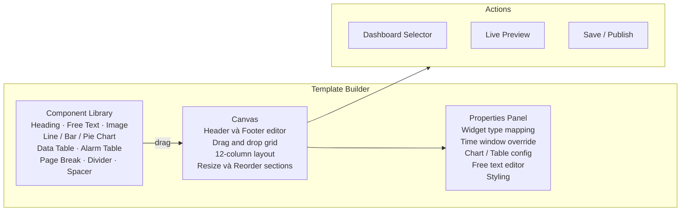

---

## 7. Report Generation Engine

### 7.1 Pipeline tổng thể

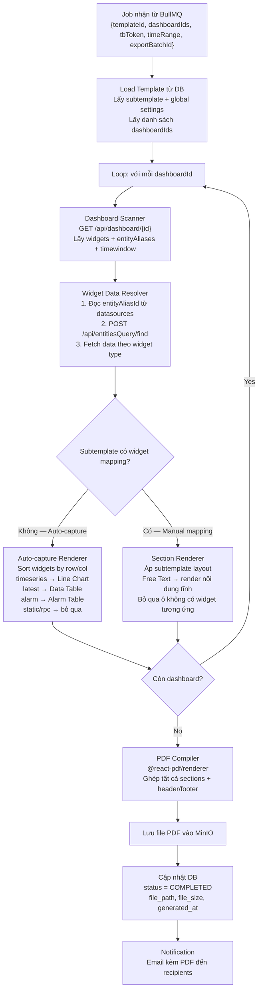

### 7.2 Widget Data Resolver — Chi tiết

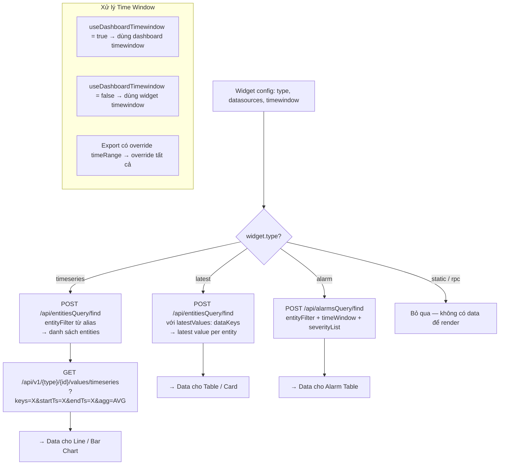

### 7.3 Chart Rendering Server-side

```
Dữ liệu timeseries từ TB API
    │  [{ts: 1680000000, value: 23.5}, ...]
    ▼
Victory Charts (SVG — pure JS, không cần canvas)
    │  <VictoryChart> → renderToStaticMarkup() → SVG string
    ▼
@react-pdf/renderer <Svg> component
    │  embed trực tiếp vào PDF layout
    ▼
PDF section với chart đã render
```

---

## 8. Luồng hoạt động

### 8.1 Tạo và cấu hình Template

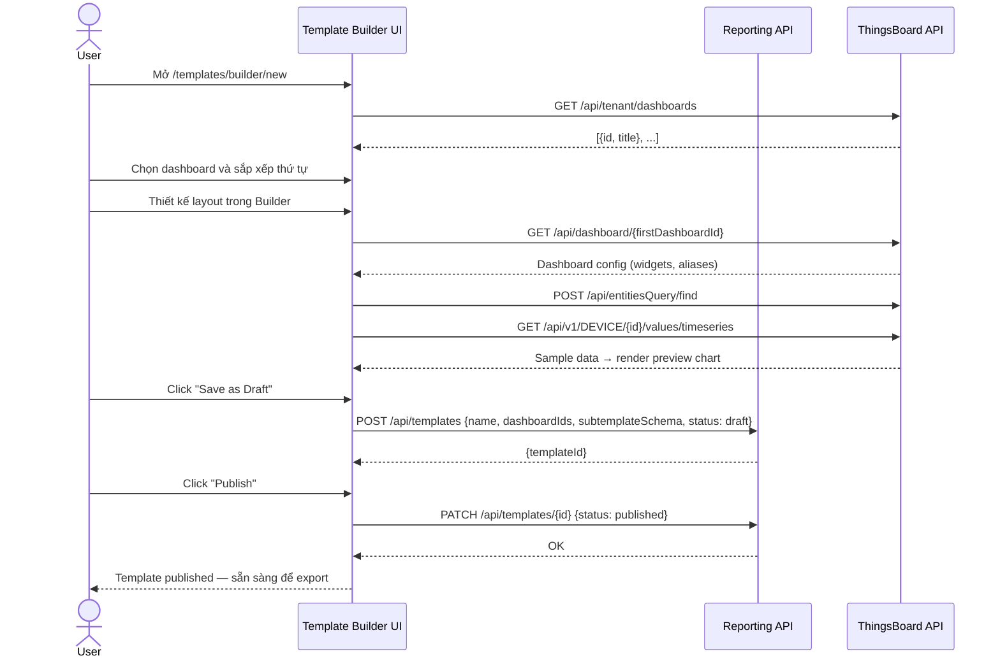

### 8.2 Export thủ công (multi-template)

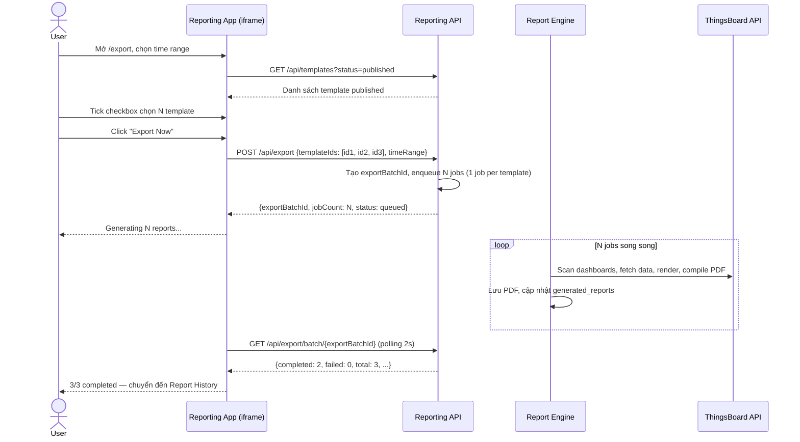

### 8.3 Auto Export theo lịch

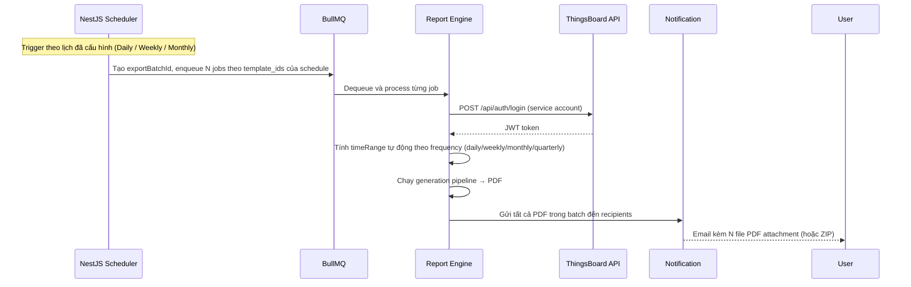

### 8.4 Xem lịch sử báo cáo (Report History)

Report History hỗ trợ 2 chế độ filter:

#### Chế độ 1: Theo lần xuất (Batch view)

Mỗi row là 1 lần export, hiển thị timestamp và tên các template trong batch.

```
[2026/03/12 22:00]  Weekly Technical · Monthly CEO Summary   [2/2]  ✓ Download ZIP
[2026/03/11 08:00]  Weekly Technical                         [1/1]  ✓ Download
[2026/03/10 07:00]  Monthly CEO Summary · Alarm Overview     [2/3]  ⚠ 2/3 thành công
```

- Timewindow filter để lọc theo khoảng thời gian
- Expand row để xem từng report trong batch và trạng thái riêng
- Nút **Download All as ZIP** trên batch (tên file: `export-2026-03-12.zip`)
- Nút **Download** từng report riêng lẻ

#### Chế độ 2: Theo template (Template view)

Hiển thị lịch sử của 1 template cụ thể theo chiều thời gian.

```
Template: [Weekly Technical Report ▼]

[2026/03/12 22:00]  manual    Last 7 days   ✓  Download
[2026/03/05 07:00]  scheduled Last 7 days   ✓  Download
[2026/02/26 07:00]  scheduled Last 7 days   ✗  Failed: TB API timeout
```

- Dropdown chọn template cần xem
- Chỉ download từng file riêng lẻ (không có ZIP vì chỉ 1 template)

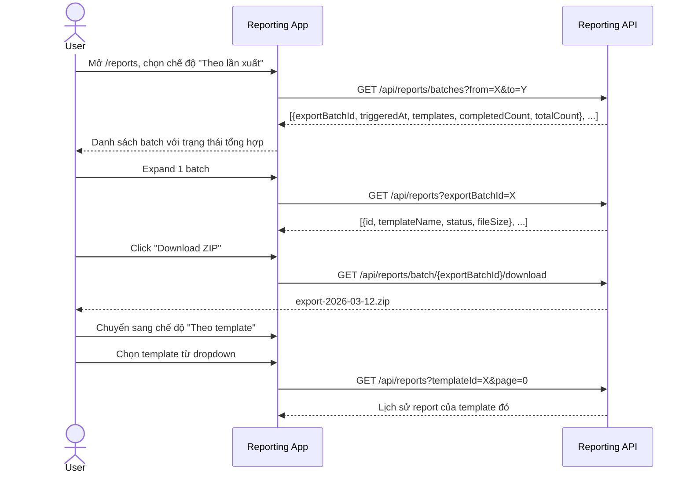

---

## 9. Cấu hình Auto Export Schedule

Người dùng cấu hình lịch export trong tab **Export Manager**. Không dùng cron expression — chỉ chọn preset:

| Preset | Thời điểm trigger | Time range tự động |
|---|---|---|
| **Daily** | Mỗi ngày lúc HH:MM (user chọn) | Yesterday 00:00 → 23:59 |
| **Weekly** | Thứ X hàng tuần lúc HH:MM | 7 ngày trước → ngày hôm đó |
| **Monthly** | Ngày D hàng tháng lúc HH:MM | Tháng trước ngày 1 → cuối tháng |
| **Quarterly** | Ngày 1 đầu mỗi quý lúc HH:MM | Quý trước ngày 1 → ngày cuối quý |

Cấu hình bổ sung:

| Trường | Mô tả | Ví dụ |
|---|---|---|
| **Name** | Tên lịch export | "Monday Morning Reports" |
| **Frequency** | Tần suất export | `DAILY` / `WEEKLY` / `MONTHLY` / `QUARTERLY` |
| **Templates** | Danh sách template (chỉ hiển thị template Published) | `["Weekly Technical", "Monthly CEO Summary"]` |
| **Timezone** | Timezone tính thời gian chạy và time range | `Asia/Ho_Chi_Minh` |
| **Recipients** | Danh sách email nhận báo cáo khi schedule chạy | `["cto@company.com", "manager@company.com"]` |
| **Service Account** | TB account dùng khi chạy scheduled job (credentials mã hoá AES-256) | `{username, encryptedPassword}` |

> **Lưu ý về Recipients:** Mỗi schedule có danh sách recipients riêng — tất cả PDF được generate trong 1 lần chạy sẽ gửi đến cùng danh sách recipients đó.

---

## 10. ThingsBoard API sử dụng

| Mục đích | Endpoint | Ghi chú |
|---|---|---|
| Auth | `POST /api/auth/login` | Service account cho scheduler |
| Refresh token | `POST /api/auth/token` | Auto-refresh khi sắp hết hạn |
| Danh sách dashboard | `GET /api/tenant/dashboards?pageSize=50&page=0` | Hiển thị trong dashboard selector |
| Config dashboard | `GET /api/dashboard/{id}` | Lấy widgets + entityAliases + timewindow |
| **Resolve entity alias** | `POST /api/entitiesQuery/find` | Truyền thẳng `alias.filter` từ dashboard config |
| **Resolve + latest values** | `POST /api/entitiesQuery/find` với `latestValues` | Lấy entity + latest telemetry trong 1 call |
| Timeseries data | `GET /api/v1/{entityType}/{id}/values/timeseries?keys=X&startTs=X&endTs=X&agg=AVG&interval=X` | Chart data |
| Attribute values | `GET /api/v1/{entityType}/{id}/values/attributes` | Latest attributes |
| Alarm data | `POST /api/alarmsQuery/find` | Truyền entityFilter + timeWindow + severityList |
| Alarm count | `POST /api/alarmsQuery/count` | Summary card |
| Tenant dashboard list | `GET /api/tenant/dashboards` | Dashboard picker trong builder |

---

## 11. Cấu trúc Database

```sql
-- Templates
CREATE TABLE report_templates (
    id             UUID PRIMARY KEY DEFAULT gen_random_uuid(),
    name           VARCHAR(255) NOT NULL,
    description    TEXT,
    tenant_id      VARCHAR(255) NOT NULL,        -- TB tenant ID
    dashboard_ids  JSONB NOT NULL DEFAULT '[]',  -- ["uuid1", "uuid2"] — thứ tự có nghĩa
    schema         JSONB NOT NULL,               -- subtemplate layout + global settings
    status         VARCHAR(20)  NOT NULL DEFAULT 'draft',
                                                 -- 'draft'     : đang soạn thảo, chưa dùng được
                                                 -- 'published' : sẵn sàng chọn để export
    created_by     VARCHAR(255),
    created_at     TIMESTAMP DEFAULT NOW(),
    updated_at     TIMESTAMP DEFAULT NOW()
);

-- Export Schedules
CREATE TABLE export_schedules (
    id               UUID PRIMARY KEY DEFAULT gen_random_uuid(),
    name             VARCHAR(255) NOT NULL,
    tenant_id        VARCHAR(255) NOT NULL,
    template_ids     JSONB NOT NULL DEFAULT '[]',
                                                 -- Danh sách template UUID cần export
                                                 -- VD: ["uuid1", "uuid2"]
                                                 -- Chỉ chứa template có status = 'published'
    frequency        VARCHAR(10) NOT NULL,        -- 'DAILY' | 'WEEKLY' | 'MONTHLY' | 'QUARTERLY'
    run_at_hour      SMALLINT NOT NULL,            -- 0-23
    run_at_minute    SMALLINT NOT NULL DEFAULT 0,  -- 0-59
    run_on_weekday   SMALLINT,                     -- 0=Mon..6=Sun (dùng cho WEEKLY)
    run_on_monthday  SMALLINT,                     -- 1-28 (dùng cho MONTHLY)
    timezone         VARCHAR(100) NOT NULL DEFAULT 'Asia/Ho_Chi_Minh',
    recipients       JSONB NOT NULL DEFAULT '[]',
                                                 -- Danh sách email nhận toàn bộ PDF trong batch
                                                 -- VD: ["cto@company.com", "ops@company.com"]
    tb_service_user  JSONB,                        -- {username, encryptedPassword} — AES-256
    is_active        BOOLEAN DEFAULT TRUE,
    last_run_at      TIMESTAMP,
    next_run_at      TIMESTAMP,
    created_by       VARCHAR(255),
    created_at       TIMESTAMP DEFAULT NOW(),
    updated_at       TIMESTAMP DEFAULT NOW()
);

-- Export Batches — nhóm các report được tạo từ cùng 1 lần export
CREATE TABLE export_batches (
    id               UUID PRIMARY KEY DEFAULT gen_random_uuid(),
    tenant_id        VARCHAR(255) NOT NULL,
    schedule_id      UUID REFERENCES export_schedules(id), -- NULL nếu manual
    triggered_by     VARCHAR(20) NOT NULL,        -- 'MANUAL' | 'SCHEDULED'
    triggered_at     TIMESTAMP DEFAULT NOW(),     -- thời điểm trigger — dùng làm display label
    time_range_from  TIMESTAMP,
    time_range_to    TIMESTAMP,
    total_count      SMALLINT NOT NULL,           -- tổng số report trong batch
    completed_count  SMALLINT NOT NULL DEFAULT 0,
    failed_count     SMALLINT NOT NULL DEFAULT 0,
    created_by       VARCHAR(255)                 -- TB user ID (NULL nếu scheduled)
);

-- Generated Reports — 1 row per template per batch
CREATE TABLE generated_reports (
    id              UUID PRIMARY KEY DEFAULT gen_random_uuid(),
    export_batch_id UUID NOT NULL REFERENCES export_batches(id),
    template_id     UUID REFERENCES report_templates(id),
    tenant_id       VARCHAR(255) NOT NULL,
    template_name   VARCHAR(255),                -- snapshot tên template lúc export
    status          VARCHAR(20) NOT NULL DEFAULT 'PENDING',
                                                 -- PENDING | PROCESSING | COMPLETED | FAILED
    file_path       VARCHAR(500),
    file_size_bytes BIGINT,
    error_message   TEXT,
    generated_at    TIMESTAMP,
    created_at      TIMESTAMP DEFAULT NOW()
);
```

---

## 12. Technology Stack

### Frontend

| Layer | Technology | Lý do |
|---|---|---|
| Framework | **React 19 + TypeScript + Vite** | SPA phù hợp cho iframe embedding, không cần SSR, Vite build nhanh và bundle nhỏ |
| Routing | `react-router-dom` v6 | Routing chuẩn cho React SPA, API ổn định, được maintain tích cực |
| State management | **Redux Toolkit + RTK Query** | RTK Query cho API calls + caching tự động, Redux slice cho UI state phức tạp (auth token, builder state) |
| Template Builder | **Craft.js** (`@craftjs/core`) | Designed cho drag & drop report/page builder trong React |
| PDF Viewer | **react-pdf** (`pdfjs-dist`) | Render PDF inline trong browser |
| Form validation | **Yup** | Schema validation khai báo rõ ràng, tích hợp tốt với React Hook Form |
| Styling | SCSS + Ant Design | Ant Design cung cấp component library đầy đủ (Table, Form, Modal...), SCSS cho custom styling |

### Backend

| Layer | Technology | Lý do |
|---|---|---|
| Framework | **NestJS + TypeScript** | Modular architecture built-in, DI system mạnh, TypeScript-first, ecosystem phong phú (BullMQ, Scheduler, Throttler) |
| ORM | **TypeORM** | TypeScript-native ORM, hỗ trợ migrations, repository pattern và decorator-based entity |
| Job Queue | **BullMQ** + Redis | Retry, priority, job status tracking |
| PDF Rendering | **@react-pdf/renderer** | React-based, flexbox layout, SVG support |
| Chart (server-side) | **Victory Charts** | Pure JS SVG — không cần native canvas, embed trực tiếp vào React-PDF |
| CSV Export | `csv-stringify` | Lightweight, streaming |
| Encryption | `crypto` (Node built-in) | AES-256 mã hóa service account credentials |
| Validation | `class-validator` + `class-transformer` | Tích hợp native với NestJS DTO validation pipeline, decorator-based |
| Scheduler | `@nestjs/schedule` + `luxon` | Built-in NestJS, tính toán next_run_at theo timezone |

### Infrastructure

| Layer | Technology | Lý do |
|---|---|---|
| Database | PostgreSQL | Mature relational database, hỗ trợ JSONB cho flexible schema storage, strong ecosystem với TypeORM |
| Cache / Queue broker | Redis | BullMQ backend |
| File Storage | MinIO (S3-compatible) | Self-hosted, presigned URL cho preview |
| Container | Docker + docker-compose | Nhất quán toàn bộ project |

---

## 13. Cấu trúc thư mục

Tổ chức file theo modular architecture.

### 13.1 Frontend (React + TypeScript + Vite)

```
NewSense.Reporting/web-app/
├── index.html
├── vite.config.ts
├── tsconfig.json
├── src/
│   ├── main.tsx
│   ├── App.tsx
│   │
│   ├── common/
│   │   ├── constants/
│   │   │   ├── routes.constant.ts
│   │   │   └── widget-type.constant.ts
│   │   ├── yup/
│   │   │   ├── template.schema.ts
│   │   │   └── schedule.schema.ts
│   │   └── helpers/
│   │       ├── time-range.helper.ts
│   │       └── widget-sort.helper.ts
│   │
│   ├── interfaces/
│   │   ├── template.interface.ts
│   │   ├── report.interface.ts
│   │   ├── export-batch.interface.ts
│   │   ├── schedule.interface.ts
│   │   ├── tb-auth.interface.ts
│   │   └── apis/
│   │       ├── template.api.ts
│   │       ├── report.api.ts
│   │       ├── export-batch.api.ts
│   │       ├── schedule.api.ts
│   │       └── tb-proxy.api.ts
│   │
│   ├── redux/
│   │   ├── store.ts
│   │   ├── apis/
│   │   │   ├── base-api.slice.ts
│   │   │   ├── template-api.slice.ts
│   │   │   ├── report-api.slice.ts
│   │   │   ├── export-batch-api.slice.ts
│   │   │   ├── schedule-api.slice.ts
│   │   │   └── tb-proxy-api.slice.ts
│   │   └── features/
│   │       ├── auth.slice.ts
│   │       └── app.slice.ts
│   │
│   ├── hooks/
│   │   ├── useTbAuth.ts
│   │   ├── useBatchPolling.ts              # Poll trạng thái export batch
│   │   └── useReportPreview.ts
│   │
│   ├── routes/
│   │   ├── index.tsx
│   │   ├── route-map.constant.ts
│   │   └── routes.ts
│   │
│   ├── utils/
│   │   ├── tb-token.util.ts
│   │   └── time-range.util.ts
│   │
│   ├── scss/
│   │
│   └── views/
│       ├── components/
│       │   └── base/
│       │       ├── BaseButton.tsx
│       │       ├── BaseModal.tsx
│       │       ├── BaseTimeRangePicker.tsx
│       │       └── BasePdfViewer.tsx
│       │
│       ├── layouts/
│       │   └── MainLayout.tsx
│       │
│       └── pages/
│           ├── embed/
│           │   └── EmbedPage.tsx
│           │
│           ├── templates/
│           │   ├── TemplateListPage.tsx
│           │   ├── components/
│           │   │   ├── TemplateCard.tsx
│           │   │   └── PublishTemplateModal.tsx
│           │   └── builder/
│           │       ├── TemplateBuilderPage.tsx
│           │       ├── components/
│           │       │   ├── BuilderCanvas.tsx
│           │       │   ├── ComponentLibrary.tsx
│           │       │   ├── PropertiesPanel.tsx
│           │       │   └── DashboardSelector.tsx
│           │       └── nodes/
│           │           ├── HeadingNode.tsx
│           │           ├── FreeTextNode.tsx
│           │           ├── ImageNode.tsx
│           │           ├── LineChartNode.tsx
│           │           ├── BarChartNode.tsx
│           │           ├── PieChartNode.tsx
│           │           ├── DataTableNode.tsx
│           │           ├── AlarmTableNode.tsx
│           │           ├── PageBreakNode.tsx
│           │           └── DividerNode.tsx
│           │
│           ├── export/
│           │   ├── ExportPage.tsx
│           │   └── components/
│           │       ├── TemplateCheckboxList.tsx    # Multi-select template để export
│           │       ├── ManualExportForm.tsx
│           │       └── ScheduleConfigForm.tsx
│           │
│           └── reports/
│               ├── ReportHistoryPage.tsx
│               ├── ReportViewerPage.tsx
│               └── components/
│                   ├── BatchViewTab.tsx            # Filter theo lần xuất
│                   ├── TemplateViewTab.tsx         # Filter theo template
│                   ├── BatchRow.tsx                # Row hiển thị 1 batch + expand
│                   ├── BatchDownloadButton.tsx     # Download ZIP toàn bộ batch
│                   ├── ReportStatusBadge.tsx
│                   └── ReportHistoryTable.tsx
```

---

### 13.2 Backend (NestJS — Modular Architecture)

```
NewSense.Reporting/server/
├── tsconfig.json
├── nest-cli.json
└── src/
    ├── main.ts
    ├── app.module.ts
    │
    ├── common/
    │   ├── constants/
    │   │   └── injection-tokens.ts
    │   ├── decorators/
    │   │   └── current-user.decorator.ts
    │   ├── enums/
    │   │   ├── report-status.enum.ts      # PENDING | PROCESSING | COMPLETED | FAILED
    │   │   ├── template-status.enum.ts    # DRAFT | PUBLISHED
    │   │   ├── schedule-frequency.enum.ts # DAILY | WEEKLY | MONTHLY | QUARTERLY
    │   │   └── widget-type.enum.ts        # TIMESERIES | LATEST | ALARM | STATIC | RPC
    │   ├── exceptions/
    │   │   ├── app-exception.filter.ts
    │   │   └── tb-api.exception.ts
    │   ├── guards/
    │   │   └── tb-auth.guard.ts
    │   ├── interceptors/
    │   │   └── transform.interceptor.ts
    │   ├── pipes/
    │   │   └── validation.pipe.ts
    │   └── helpers/
    │       └── encryption.helper.ts
    │
    ├── configs/
    │   ├── app.config.ts
    │   ├── database.config.ts
    │   ├── redis.config.ts
    │   └── minio.config.ts
    │
    ├── database/
    │   └── orm/
    │       ├── data-source.ts
    │       ├── entities/
    │       │   ├── base.entity.ts
    │       │   ├── report-template.entity.ts
    │       │   ├── export-schedule.entity.ts
    │       │   ├── export-batch.entity.ts
    │       │   └── generated-report.entity.ts
    │       └── migrations/
    │
    ├── modules/
    │   │
    │   ├── auth/
    │   │   ├── auth.module.ts
    │   │   ├── controllers/
    │   │   │   └── auth.controller.ts
    │   │   ├── services/
    │   │   │   └── auth.service.ts
    │   │   └── validators/
    │   │       └── validate-token.validator.ts
    │   │
    │   ├── template/
    │   │   ├── template.module.ts
    │   │   ├── controllers/
    │   │   │   └── template.controller.ts
    │   │   ├── services/
    │   │   │   └── template.service.ts    # CRUD + publish/unpublish
    │   │   ├── repositories/
    │   │   │   └── template.repository.ts
    │   │   └── validators/
    │   │       ├── create-template.validator.ts
    │   │       └── update-template.validator.ts
    │   │
    │   ├── export/
    │   │   ├── export.module.ts
    │   │   ├── controllers/
    │   │   │   ├── export.controller.ts       # POST /export — tạo batch + enqueue N jobs
    │   │   │   └── schedule.controller.ts
    │   │   ├── services/
    │   │   │   ├── export.service.ts          # Tạo exportBatch, enqueue jobs per template
    │   │   │   └── schedule.service.ts
    │   │   ├── repositories/
    │   │   │   ├── export-batch.repository.ts
    │   │   │   └── schedule.repository.ts
    │   │   └── validators/
    │   │       ├── trigger-export.validator.ts
    │   │       └── create-schedule.validator.ts
    │   │
    │   ├── report/
    │   │   ├── report.module.ts
    │   │   ├── controllers/
    │   │   │   └── report.controller.ts       # GET /reports, batch download ZIP
    │   │   ├── services/
    │   │   │   └── report.service.ts          # List by batch / by template, ZIP builder
    │   │   └── repositories/
    │   │       └── report.repository.ts
    │   │
    │   └── tb-proxy/
    │       ├── tb-proxy.module.ts
    │       ├── controllers/
    │       │   └── tb-proxy.controller.ts
    │       └── services/
    │           └── tb-proxy.service.ts
    │
    └── shared/
        │
        ├── engine/
        │   ├── engine.module.ts
        │   ├── engine.processor.ts
        │   │
        │   ├── services/
        │   │   ├── dashboard-scanner.service.ts
        │   │   ├── data-fetcher.service.ts
        │   │   ├── pdf-compiler.service.ts
        │   │   └── storage.service.ts
        │   │
        │   ├── strategies/
        │   │   ├── widget-renderer.strategy.ts
        │   │   ├── timeseries-widget.strategy.ts
        │   │   ├── latest-widget.strategy.ts
        │   │   ├── alarm-widget.strategy.ts
        │   │   └── widget-renderer.factory.ts
        │   │
        │   └── renderers/
        │       ├── section-header.renderer.tsx
        │       ├── free-text.renderer.tsx
        │       ├── line-chart.renderer.tsx
        │       ├── bar-chart.renderer.tsx
        │       ├── pie-chart.renderer.tsx
        │       ├── data-table.renderer.tsx
        │       └── alarm-table.renderer.tsx
        │
        ├── scheduler/
        │   ├── scheduler.module.ts
        │   └── services/
        │       └── scheduler.service.ts
        │
        └── tb-client/
            ├── tb-client.module.ts
            ├── interfaces/
            │   └── tb-client.interface.ts
            └── services/
                └── tb-client.service.ts
```

---

## 14. Điểm cần lưu ý khi triển khai

1. **Batch enqueue:** Khi nhận request `POST /api/export {templateIds: [id1, id2, id3]}`, backend tạo 1 `export_batch` trước, rồi enqueue N jobs riêng lẻ (mỗi job mang `exportBatchId`). Các job chạy song song — nếu 1 job failed không ảnh hưởng các job còn lại.

2. **Batch status aggregation:** `export_batches.completed_count` và `failed_count` được update mỗi khi 1 job hoàn thành. Frontend polling `GET /api/export/batch/{id}` mỗi 2s cho đến khi `completed + failed = total`.

3. **ZIP download:** Khi user download cả batch, backend stream các file PDF từ MinIO vào ZIP on-the-fly (không cần tạo file ZIP trên disk). Tên file trong ZIP theo format `{template-name}.pdf`.

4. **Auto-capture widget ordering:** Sort theo `(row ASC, col ASC)` để giữ thứ tự tự nhiên như dashboard gốc.

5. **Widget type không hỗ trợ:** `type = 'static'` và `type = 'rpc'` bỏ qua khi generate. Builder hiển thị warning nếu user cố map component với loại này.

6. **Dynamic alias trong dashboard:** Alias phụ thuộc dashboard state không resolve được offline. Detect và bỏ qua, hoặc dùng toàn bộ entities của alias gốc.

7. **`POST /api/entitiesQuery/find` là key API:** Nhận trực tiếp `entityFilter` từ dashboard JSON, trả về entities đã resolve. Không cần tự implement logic resolve alias.

8. **Token cho scheduled job:** Service account credentials mã hoá AES-256 trước khi lưu DB. Mỗi schedule lưu credentials riêng.

9. **PDF preview với MinIO:** Presigned URL TTL 15 phút để serve PDF cho inline viewer.

10. **Pagination TB API:** `POST /api/entitiesQuery/find` trả max 100 entities. Nếu alias resolve ra nhiều entity, cần loop pagination trước khi fetch timeseries.

---

## 15. API Contract

Toàn bộ API đều yêu cầu header `X-TB-Token: <jwt>` (trừ `/health`). Backend validate token với TB và extract `tenant_id` cho mọi request.

### 15.1 Auth

| Method | Endpoint | Mô tả |
|---|---|---|
| `POST` | `/api/auth/validate` | Validate TB JWT, trả về tenant info |

```
POST /api/auth/validate
Body:   { token: string }
200:    { tenantId: string, userId: string, authorities: string[] }
401:    token invalid hoặc expired
```

### 15.2 Templates

| Method | Endpoint | Mô tả |
|---|---|---|
| `GET` | `/api/templates` | Danh sách template của tenant |
| `POST` | `/api/templates` | Tạo template mới (status: draft) |
| `GET` | `/api/templates/:id` | Chi tiết 1 template |
| `PUT` | `/api/templates/:id` | Cập nhật template (chỉ khi draft) |
| `DELETE` | `/api/templates/:id` | Xóa template |
| `PATCH` | `/api/templates/:id/publish` | draft → published |
| `PATCH` | `/api/templates/:id/unpublish` | published → draft |

```
GET /api/templates?status=published&page=0&size=20
200: { data: [{ id, name, description, status, dashboardIds, createdAt, updatedAt }], total, page, size }

POST /api/templates
Body: { name, description?, dashboardIds: string[], schema: SubtemplateSchema }
201: { id, name, status: "draft", createdAt }
400: validation error
409: name đã tồn tại trong tenant

PUT /api/templates/:id
Body: { name?, description?, dashboardIds?, schema? }
200: template updated
403: không thể sửa template đang published
404: not found

PATCH /api/templates/:id/publish    → 200: { id, status: "published" }
PATCH /api/templates/:id/unpublish  → 200: { id, status: "draft" }
                                      409: đang được schedule active tham chiếu

DELETE /api/templates/:id           → 204: deleted
                                      409: đang được schedule active tham chiếu
```

### 15.3 Export (Manual)

| Method | Endpoint | Mô tả |
|---|---|---|
| `POST` | `/api/export` | Trigger manual export (multi-template) |
| `GET` | `/api/export/batches` | Danh sách export batch |
| `GET` | `/api/export/batches/:batchId` | Trạng thái batch (dùng để poll) |
| `GET` | `/api/export/batches/:batchId/download` | Tải ZIP toàn bộ batch |

```
POST /api/export
Body: { templateIds: string[], timeRange: { from: number, to: number } }
202: { exportBatchId, totalCount, status: "queued" }
400: templateIds rỗng hoặc chứa template chưa published

GET /api/export/batches?from=ISO&to=ISO&page=0&size=20
200: { data: [{ id, triggeredBy, triggeredAt, timeRangeFrom, timeRangeTo,
               totalCount, completedCount, failedCount, templateNames }], total }

GET /api/export/batches/:batchId
200: { id, triggeredBy, triggeredAt, totalCount, completedCount, failedCount,
       reports: [{ id, templateName, status, fileSizeBytes }] }

GET /api/export/batches/:batchId/download
200: application/zip — Content-Disposition: attachment; filename="export-{YYYY-MM-DD}.zip"
409: batch chưa hoàn thành
```

### 15.4 Schedules

| Method | Endpoint | Mô tả |
|---|---|---|
| `GET` | `/api/schedules` | Danh sách schedule |
| `POST` | `/api/schedules` | Tạo schedule mới |
| `GET` | `/api/schedules/:id` | Chi tiết schedule |
| `PUT` | `/api/schedules/:id` | Cập nhật schedule |
| `DELETE` | `/api/schedules/:id` | Xóa schedule |
| `PATCH` | `/api/schedules/:id/activate` | Bật schedule |
| `PATCH` | `/api/schedules/:id/deactivate` | Tắt schedule |

```
POST /api/schedules
Body: { name, templateIds: string[], frequency: "DAILY"|"WEEKLY"|"MONTHLY"|"QUARTERLY",
        runAtHour, runAtMinute, runOnWeekday?, runOnMonthday?,
        timezone, recipients: string[], tbServiceUser: { username, password } }
201: { id, name, frequency, nextRunAt, isActive: true }
422: tbServiceUser credentials sai (backend test login TB khi tạo)

PUT /api/schedules/:id   → 200: schedule updated, nextRunAt tính lại
DELETE /api/schedules/:id → 204: deleted
PATCH /api/schedules/:id/activate   → 200: { id, isActive: true, nextRunAt }
PATCH /api/schedules/:id/deactivate → 200: { id, isActive: false }
```

### 15.5 Reports

| Method | Endpoint | Mô tả |
|---|---|---|
| `GET` | `/api/reports` | Danh sách report (filter by batch hoặc template) |
| `GET` | `/api/reports/:id` | Chi tiết 1 report |
| `GET` | `/api/reports/:id/preview-url` | Presigned URL để xem inline |
| `GET` | `/api/reports/:id/download` | Tải file PDF |

```
GET /api/reports?exportBatchId=X&page=0&size=20
GET /api/reports?templateId=X&page=0&size=20
200: { data: [{ id, templateId, templateName, exportBatchId,
               triggeredBy, status, fileSizeBytes, generatedAt }], total }

GET /api/reports/:id/preview-url
200: { url: "https://minio.host/...", expiresAt: ISO }
409: report chưa COMPLETED

GET /api/reports/:id/download
200: application/pdf stream — Content-Disposition: attachment; filename="..."
409: report chưa COMPLETED
```

### 15.6 TB Proxy

| Method | Endpoint | Forward tới TB |
|---|---|---|
| `GET` | `/api/tb/dashboards` | `GET /api/tenant/dashboards` |
| `GET` | `/api/tb/dashboards/:id` | `GET /api/dashboard/:id` |
| `POST` | `/api/tb/entities/find` | `POST /api/entitiesQuery/find` |
| `GET` | `/api/tb/timeseries/:type/:id` | `GET /api/v1/{type}/{id}/values/timeseries` |

### 15.7 Health

```
GET /health  (không cần auth)
200: { status: "ok", db: "up", redis: "up", minio: "up" }
503: { status: "degraded", db: "down", ... }
```

---

## 16. State Machines

### 16.1 Template Status

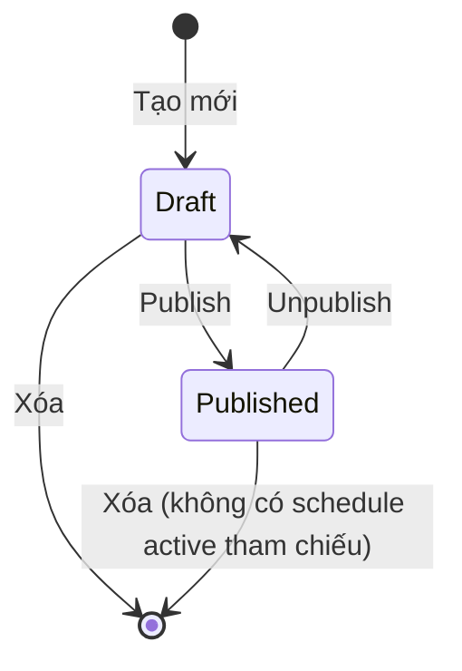

| Trạng thái | Ý nghĩa | Có thể export? |
|---|---|---|
| **Draft** | Đang soạn thảo, chưa sẵn sàng | Không |
| **Published** | Sẵn sàng sử dụng | Có |

**Ràng buộc:**
- Template Published không thể sửa nội dung — phải Unpublish trước
- Không thể xóa template Published đang được schedule `is_active = true` tham chiếu

### 16.2 Job Status

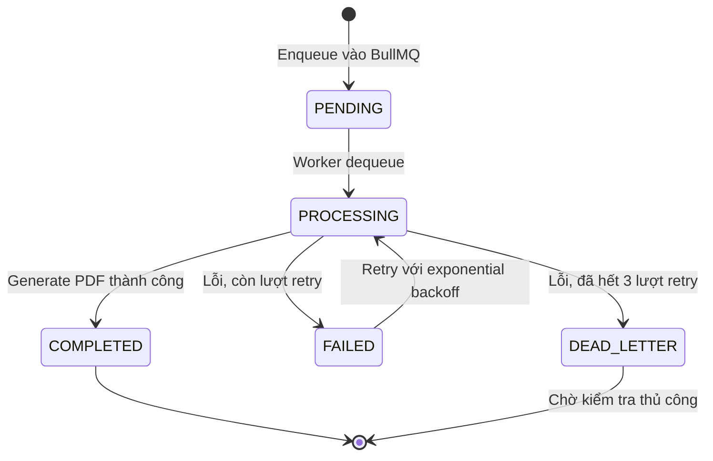

| Trạng thái | Ý nghĩa |
|---|---|
| **PENDING** | Đã enqueue, chờ worker nhận. Bản ghi `generated_reports` đã được tạo. |
| **PROCESSING** | Worker đang thực hiện: scan → fetch data → render → compile PDF. |
| **COMPLETED** | PDF đã lưu vào MinIO, `file_path` và `file_size_bytes` đã cập nhật. |
| **FAILED** | Thất bại, số lần retry < 3. BullMQ tự retry theo exponential backoff. |
| **DEAD_LETTER** | Đã retry đủ 3 lần, vẫn thất bại. `error_message` lưu nguyên nhân cuối. Cần kiểm tra thủ công. |

**Retry policy:** 10s → 30s → 60s → DEAD_LETTER

**`export_batches` update sau mỗi job:**
- COMPLETED → `completed_count++`
- DEAD_LETTER → `failed_count++`

---

## 17. Security Architecture

### 17.1 Transport Security

| Yêu cầu | Chi tiết |
|---|---|
| **HTTPS** | Toàn bộ traffic qua TLS 1.2+ (TLS 1.3 preferred) |
| **HSTS** | `Strict-Transport-Security: max-age=31536000; includeSubDomains` |
| **Iframe** | TB host và Reporting host đều phải HTTPS trong production |

### 17.2 Authentication & Authorization

```
Luồng validate mỗi request:
  1. Backend nhận X-TB-Token header
  2. Gọi TB GET /api/auth/user với token → lấy { tenantId, userId, authorities }
  3. Cache kết quả trong Redis (TTL = TB_TOKEN_CACHE_TTL_SECONDS, default 60s)
  4. Inject tenantId vào request context
  5. Mọi DB query đều filter WHERE tenant_id = :tenantId (row-level isolation)
```

**Phân quyền:**
| Authority | Quyền |
|---|---|
| `TENANT_ADMIN` | Full access: quản lý template, schedule, xem tất cả report |
| `CUSTOMER_USER` | Read-only: chỉ xem report, không tạo/xóa template hoặc schedule |

### 17.3 CORS Configuration

```typescript
app.enableCors({
  origin: process.env.CORS_ALLOWED_ORIGINS.split(','),
  methods: ['GET', 'POST', 'PUT', 'PATCH', 'DELETE'],
  allowedHeaders: ['Content-Type', 'X-TB-Token'],
  credentials: false,
});
```

### 17.4 HTTP Security Headers (helmet.js)

| Header | Giá trị |
|---|---|
| `Content-Security-Policy` | `default-src 'self'; frame-ancestors 'self' <TB_HOST>` |
| `X-Content-Type-Options` | `nosniff` |
| `Strict-Transport-Security` | `max-age=31536000; includeSubDomains` |
| `Referrer-Policy` | `strict-origin-when-cross-origin` |
| `Permissions-Policy` | `camera=(), microphone=(), geolocation=()` |
| `Cache-Control` | `no-store` (cho API response) |

### 17.5 Input Validation & Injection Prevention

- `class-validator` + `class-transformer` trên tất cả DTO
- TypeORM parameterized queries — không string-concatenate SQL
- JSONB fields: validate schema trước khi lưu
- Free Text node trong template: sanitize HTML (strip `<script>`, event handlers) trước khi render PDF
- MinIO file path dùng UUID — không cho phép path traversal

### 17.6 Rate Limiting (`@nestjs/throttler` + Redis store)

| Endpoint | Limit |
|---|---|
| `POST /api/export` | 10 req / phút / tenant |
| `POST /api/schedules` | 20 req / phút / tenant |
| `GET /api/reports/:id/preview-url` | 60 req / phút / user |
| `GET /api/tb/*` | 100 req / phút / tenant |
| Tất cả endpoints | 300 req / phút / IP |

### 17.7 Data Security

| Dữ liệu | Biện pháp |
|---|---|
| TB JWT token | Chỉ lưu in-memory (React state), không persist |
| Service account password | AES-256-GCM encrypt, key từ `ENCRYPTION_KEY` env |
| PDF files | MinIO private bucket, chỉ access qua presigned URL TTL 15 phút |
| Logs | Mask token, password, email trước khi ghi log |

### 17.8 OWASP Top 10 Mitigation

| Risk | Mitigation |
|---|---|
| A01 Broken Access Control | Tenant isolation mọi query, authority check per endpoint |
| A02 Cryptographic Failures | TLS 1.2+, AES-256-GCM cho credentials, presigned URL ngắn hạn |
| A03 Injection | TypeORM parameterized queries, class-validator, HTML sanitize |
| A05 Security Misconfiguration | Helmet.js headers, CORS allowlist, ẩn stack trace production |
| A06 Vulnerable Components | `npm audit` trong CI, Dependabot auto-PR |
| A07 Auth Failures | Validate TB token mỗi request, cache 60s, reject expired ngay |
| A09 Logging Failures | Structured logging (Pino), redact sensitive fields |

---

## 18. Error Handling Strategy

### 18.1 Standard Error Response — RFC 7807 Problem Details

```json
{
  "type": "https://reporting.newsense.vn/errors/template-not-found",
  "title": "Template Not Found",
  "status": 404,
  "detail": "Template 'abc-123' does not exist or is not accessible for this tenant.",
  "instance": "/api/templates/abc-123",
  "traceId": "4bf92f3577b34da6a3ce929d0e0e4736"
}
```

| Field | Mô tả |
|---|---|
| `type` | URI định danh loại lỗi — stable, không đổi theo version |
| `title` | Tên lỗi ngắn gọn, human-readable |
| `status` | HTTP status code |
| `detail` | Mô tả chi tiết, có thể hiện cho user |
| `instance` | Request path gây ra lỗi |
| `traceId` | Correlation ID để trace trong log |

### 18.2 HTTP Error Categories

| Status | Loại | Ví dụ |
|---|---|---|
| 400 | Validation Error | Field thiếu, sai format, templateIds rỗng |
| 401 | Unauthorized | TB token hết hạn, invalid |
| 403 | Forbidden | CUSTOMER_USER cố tạo template |
| 404 | Not Found | Template/report không tồn tại hoặc thuộc tenant khác |
| 409 | Conflict | Sửa template đang published, xóa template đang được schedule tham chiếu |
| 422 | Unprocessable | tbServiceUser credentials sai |
| 429 | Rate Limited | Vượt giới hạn request |
| 502 | TB API Error | ThingsBoard không phản hồi |
| 503 | Service Unavailable | DB down, Redis down |

### 18.3 TB API Error Handling

```
TB 401 (token expired)
  → API request: trả 401 cho client ngay
  → Scheduled job: FAILED → retry → nếu vẫn 401 sau 3 lần → DEAD_LETTER

TB 429 (rate limit)
  → Backoff theo Retry-After header
  → Trong job: tính vào retry delay

TB 5xx / timeout (30s)
  → Retry: 10s → 30s → 60s → DEAD_LETTER
```

### 18.4 Job Error Handling

```
Lỗi transient (network, TB timeout)
  → BullMQ tự retry với exponential backoff

Lỗi non-transient (schema corrupt, dashboard bị xóa)
  → Ghi error_message vào generated_reports
  → removeOnFail: false — giữ lại để debug
  → Không retry — chuyển DEAD_LETTER ngay

Partial failure trong 1 batch
  → Batch vẫn hoàn thành (completedCount + failedCount = totalCount)
  → Email thông báo kèm danh sách report thành công và thất bại
```

---

## 19. Scalability & Queue Configuration

### 19.1 Khuyến nghị Worker — VM 4 CPU / 8GB RAM

| Thành phần | CPU | RAM |
|---|---|---|
| NestJS API Server | 1 core | ~500 MB |
| BullMQ Worker × 3 | 3 cores | ~400 MB × 3 = 1.2 GB |
| Redis (local) | 0.5 core | ~200 MB |
| OS + overhead | 0.5 core | ~500 MB |
| **Tổng** | **~5 core** (hyperthreading) | **~2.4 GB / 8 GB** |

**Khuyến nghị: 3 worker instances** (`WORKER_INSTANCES=3`), mỗi worker `WORKER_CONCURRENCY=1`.
Còn ~5.5 GB RAM buffer khi render PDF lớn.

> Nâng VM lên 8 CPU / 16GB: tăng được lên 6 worker instances.

### 19.2 BullMQ Queue Configuration

```typescript
// Hai queue tách biệt để ưu tiên manual export
const MANUAL_QUEUE    = 'report:manual';    // high priority
const SCHEDULED_QUEUE = 'report:scheduled'; // normal priority

const jobOptions = {
  attempts: 3,
  backoff: { type: 'exponential', delay: 10_000 },
  removeOnComplete: { count: 100 },
  removeOnFail: false,   // giữ lại failed jobs để debug
};
```

### 19.3 Kịch bản 20 schedule trigger cùng lúc lúc 7:00

```
20 schedules × 3 template = 60 jobs enqueue đồng thời
→ 3 workers xử lý lần lượt (FIFO)
→ Throughput: ~3 jobs/phút (~20s/job dashboard nhỏ)
→ 60 jobs hoàn thành trong ~20 phút
→ Queue là bộ đệm tự nhiên — không gây crash
```

---

## 20. Storage & Retention Policy

### 20.1 Vòng đời PDF

```
Generate xong
  → Lưu MinIO: {tenantId}/{year}/{month}/{reportId}.pdf
  → Phục vụ qua presigned URL (TTL 15 phút)
       ↓ (sau REPORT_RETENTION_DAYS ngày, default 60)
Cleanup job chạy hàng ngày 02:00
  → Copy sang AWS S3 Glacier
  → Xóa khỏi MinIO
  → Cập nhật generated_reports: file_path → s3://..., archived_at = NOW
       ↓
AWS S3 Glacier (lưu trữ dài hạn, restore on-demand nếu cần)
```

### 20.2 ZIP download — on-the-fly

ZIP **không lưu lại** — stream trực tiếp cho client bằng `archiver`:

```
GET /api/export/batches/:id/download
  → Fetch danh sách file_path từ DB
  → Stream từng PDF từ MinIO → archiver → HTTP response
  → Không buffer toàn bộ trong memory
  → Tên file trong ZIP: {template-name}.pdf
```

---

## 21. ER Diagram

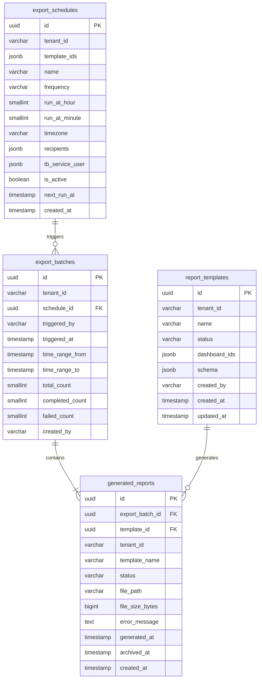

---

## 22. Environment Variables

```env
# ─── App ─────────────────────────────────────────────
PORT=3000
NODE_ENV=production                     # development | production

# ─── ThingsBoard ─────────────────────────────────────
TB_HOST=http://localhost:8080
TB_TOKEN_CACHE_TTL_SECONDS=60

# ─── Database ────────────────────────────────────────
DB_HOST=localhost
DB_PORT=5432
DB_NAME=newsense_reporting
DB_USER=reporting_user
DB_PASSWORD=<secret>
DB_SSL=false

# ─── Redis ───────────────────────────────────────────
REDIS_HOST=localhost
REDIS_PORT=6379
REDIS_PASSWORD=

# ─── MinIO ───────────────────────────────────────────
MINIO_ENDPOINT=localhost
MINIO_PORT=9000
MINIO_USE_SSL=false
MINIO_ACCESS_KEY=<secret>
MINIO_SECRET_KEY=<secret>
MINIO_BUCKET_NAME=reporting-pdfs

# ─── AWS S3 (deep archive) ───────────────────────────
ARCHIVE_TO_S3=true
AWS_REGION=ap-southeast-1
AWS_ACCESS_KEY_ID=<secret>
AWS_SECRET_ACCESS_KEY=<secret>
AWS_S3_ARCHIVE_BUCKET=newsense-reporting-archive
AWS_S3_STORAGE_CLASS=DEEP_ARCHIVE      # DEEP_ARCHIVE | GLACIER | STANDARD_IA

# ─── Storage & Retention ─────────────────────────────
REPORT_RETENTION_DAYS=60
PRESIGNED_URL_TTL_MINUTES=15
CLEANUP_CRON=0 2 * * *                 # 02:00 hàng ngày

# ─── BullMQ Worker ───────────────────────────────────
WORKER_CONCURRENCY=1                   # Job đồng thời per worker instance
WORKER_INSTANCES=3                     # Số worker process (khuyến nghị 3 với 4 CPU / 8GB)
JOB_MAX_RETRIES=3
JOB_RETRY_DELAY_MS=10000              # Delay retry đầu tiên (exponential sau đó)

# ─── Security ────────────────────────────────────────
ENCRYPTION_KEY=<32-byte-hex>           # AES-256-GCM key mã hoá service account credentials
CORS_ALLOWED_ORIGINS=http://localhost:8080,http://localhost:3100

# ─── Rate Limiting ───────────────────────────────────
THROTTLE_TTL_SECONDS=60
THROTTLE_LIMIT=300

# ─── Email (SMTP) ────────────────────────────────────
SMTP_HOST=smtp.gmail.com
SMTP_PORT=587
SMTP_SECURE=false
SMTP_USER=noreply@company.com
SMTP_PASSWORD=<secret>
SMTP_FROM=NewSense Reporting <noreply@company.com>
```

---

## 23. Architecture Decision Records (ADRs)

### ADR-001: React + Vite thay vì Next.js

**Quyết định:** React 19 + Vite cho frontend.

**Lý do:** App nhúng trong TB iframe — không có URL riêng, không cần SEO, không cần SSR. Next.js thêm complexity không cần thiết. Vite build nhanh hơn, bundle nhỏ hơn, phù hợp cho SPA đơn giản.

**Loại bỏ:** Next.js (overkill), Create React App (deprecated).

---

### ADR-002: BullMQ thay vì Bull

**Quyết định:** BullMQ làm job queue.

**Lý do:** BullMQ là successor của Bull, viết lại bằng TypeScript, hỗ trợ Redis 6+ Streams, đang được maintain tích cực. Bull ở maintenance mode. `@nestjs/bullmq` có official integration.

**Loại bỏ:** Bull (deprecated), Agenda (MongoDB-based), AWS SQS (cloud dependency).

---

### ADR-003: Victory Charts thay vì Chart.js / D3

**Quyết định:** Victory Charts để render chart server-side.

**Lý do:** Chart.js yêu cầu DOM/canvas — không chạy được trong Node.js worker. D3 cần DOM manipulation. Victory là pure React/SVG, chạy với `renderToStaticMarkup()` trong Node.js, output SVG embed trực tiếp vào `@react-pdf/renderer`.

**Loại bỏ:** Chart.js + jsdom (không ổn định), D3 + JSDOM (phức tạp), Puppeteer screenshot (phụ thuộc Chrome).

---

### ADR-004: @react-pdf/renderer thay vì Puppeteer

**Quyết định:** `@react-pdf/renderer` để tạo PDF.

**Lý do:** Puppeteer yêu cầu Chrome headless (~300MB), không kiểm soát layout, khó test. `@react-pdf/renderer` là pure Node.js, layout flexbox, embed SVG chart trực tiếp, không cần browser. Output PDF sạch và nhẹ hơn screenshot.

**Loại bỏ:** Puppeteer (Chrome dependency), wkhtmltopdf (unmaintained), jsPDF (client-side only).

---

### ADR-005: MinIO + AWS S3 Glacier (2-tier storage)

**Quyết định:** MinIO cho hot storage (2 tháng), AWS S3 Glacier cho cold archive.

**Lý do:** MinIO self-hosted, S3-compatible, không phụ thuộc cloud cho MVP. Sau 2 tháng PDF ít được truy cập — Glacier rẻ hơn ~15x so với S3 Standard. Tách hot/cold giúp MinIO không phình to theo thời gian.

**Loại bỏ:** Chỉ dùng S3 (cloud dependency), chỉ dùng disk (không scalable, khó backup).

---

### ADR-006: JSONB cho `template_ids` trong `export_schedules`

**Quyết định:** JSONB thay vì junction table.

**Lý do:** Junction table tốt hơn cho referential integrity nhưng thêm bảng và JOIN. Use case chỉ cần đọc list IDs rồi fetch template theo ID — không có query phức tạp. JSONB đơn giản hóa schema mà không giảm functionality.

**Đánh đổi:** Không có FK constraint trên từng ID trong array. Mitigated bằng application-level validation.

---

### ADR-007: Iframe embedding + JWT passthrough thay vì standalone auth

**Quyết định:** Nhúng app vào TB qua Custom HTML Widget iframe, dùng chung TB JWT.

**Lý do:** Không cần xây auth riêng. User đã login TB → tự động có quyền dùng Reporting. Single entry point. Đơn giản hóa deployment và UX.

**Rủi ro & mitigation:** Token passthrough qua `postMessage` — chỉ chấp nhận message từ TB origin, validate token server-side mỗi request.

**Loại bỏ:** Standalone login riêng (double login), OAuth2 với TB (TB CE không support OAuth2 server).

---

### ADR-008: Tách `export_batches` thành bảng riêng

**Quyết định:** Bảng `export_batches` thay vì cột `batch_id` trong `generated_reports`.

**Lý do:** Batch có metadata riêng (trigger time, time range, progress counters) không thuộc về từng report. Tách ra giúp query batch status không cần aggregate `generated_reports` mỗi lần poll. Batch View UI query đơn giản hơn — 1 row per batch với progress built-in.
