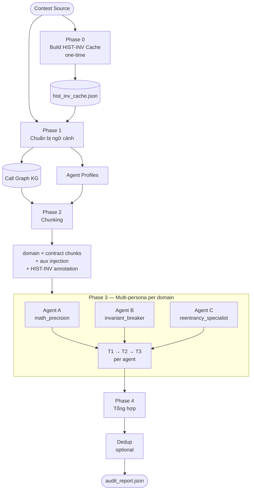

# Multi-Expert Contract Audit Panel (MECAP)

---

## I. Kiến trúc Pipeline

---

## Phase 0 — Build HIST-INV Cache (một lần, dùng lại)

**Mục tiêu:** Pre-compute invariants cho từng function trong contest, lưu cache để các lần chạy sim_e2e sau không tốn thêm LLM call.

Script riêng: `populate_hist_inv_cache.py` — chạy một lần trước khi chạy sim_e2e lần đầu của một contest.

0. **Build HIST-INV cache** — Với mỗi function trong contest, tìm kiếm các invariants liên quan từ lịch sử audit và lưu vào `hist_inv_cache.json`.

**Dữ liệu nguồn:** ~3,366 audit findings thực từ Solodit (Code4rena, Sherlock, ...), mỗi finding được tách thành 4 sections: mô tả lỗi, code snippet, mô tả operation, và invariant statement. Phần invariant là input chính cho bước này.

**Kiến trúc RAG:** 4 ChromaDB collections tương ứng 4 sections. Phase 0 dùng collection `solodit_op` — mô tả các thao tác cơ học của từng finding (cast, subtract, approve, ...) — phù hợp để match với function theo hành vi, không phụ thuộc vào tên biến hay naming convention của từng contest.

**Query:** Với mỗi function, sinh một câu query mô tả những gì function đó làm, rồi vector search trong `solodit_op` để tìm các historical findings có hành vi tương đồng. Từ các findings match được, lấy ra phần invariant tương ứng.

**Tác dụng:** Agents nhận được gợi ý "function này về lịch sử hay bị lỗi kiểu gì" dưới dạng comment `[HIST-INV]` ngay trong source code, giúp định hướng T2 tìm đúng loại bug thay vì scan mù.

**Cơ chế dùng lại:** Cache được load sẵn ở đầu mỗi run, không rebuild lại. Kết quả deterministic nên không bao giờ stale trừ khi có thay đổi thực sự.

**Selective invalidation:** Chỉ rebuild phần cần thiết, không xóa toàn bộ:
- Đổi source một function → xóa entry của function đó, rebuild lại mình nó
- Đổi cả contract → xóa entries của contract đó
- Đổi RAG DB hoặc query logic → xóa toàn bộ và rebuild
- Đổi agent prompt hay config sim_e2e → không cần làm gì

---

## Phase 1 — Chuẩn bị ngữ cảnh

**Mục tiêu:** Thu thập toàn bộ thông tin về codebase trước khi chạy agents.

1. **Đọc contracts** — Scan toàn bộ thư mục, load source code của mọi `.sol` file.
2. **Build call graph (KG)** — Dùng toàn bộ source để tạo call graph, biết function nào gọi function nào. Kết quả được cache lại để không cần build lại ở lần chạy sau.
3. **Load HIST-INV** — Đọc cache các invariants lịch sử đã match với contest này (từ `hist_inv_cache.json` + `rag_sections_cache.json`). Mỗi function sẽ có một tập invariants để dùng trong bước inject.
4. **Tạo agent profiles** — Sinh ra danh sách expert agents với persona và system prompt riêng, dựa trên primary contract.

---

## Phase 2 — Chia nhỏ bài toán (Chunking)

**Mục tiêu:** Biến N contracts × M functions thành các bài toán nhỏ hơn để agent có thể focus.

5. **Phân loại functions theo domain** — Mỗi function trong GT contracts được gán 1 domain (`math_cast`, `access_reward`, `general`...) dựa trên tên function. Các functions cùng domain × cùng contract tạo thành 1 chunk.
6. **Build source cho từng chunk** — Mỗi chunk nhận một đoạn source đã được chuẩn bị riêng: chỉ giữ header + các functions cần audit, đính kèm source của contracts liên quan (aux), và source của parent contracts nếu có.
7. **Inject context vào source** — Trước khi đưa cho agent, source được bổ sung thêm: call graph block của chunk, và các `[HIST-INV]` comments gắn vào từng function tương ứng.

---

## Phase 3 — Chạy agents song song

**Mục tiêu:** Mỗi chunk được nhiều agents kiểm tra độc lập theo 3 rounds.

**Multi-agent per domain:** Mỗi domain không chỉ có 1 agent mà có một tập agents với persona khác nhau — ví dụ domain `math_cast` có `math_precision` (chuyên số học chính xác), `invariant_breaker` (tìm điều kiện phá vỡ bất biến), `reentrancy_specialist` (chuyên reentrancy), `evm_hardener` (chuyên EVM-level bugs)... Tất cả cùng nhìn vào một đoạn code nhưng từ góc độ chuyên môn và chiều sâu khác nhau trong lĩnh vực đó.

**Điểm mạnh của kiến trúc này:**
- Một bug hiếm khi được tất cả agents đồng thời bỏ sót — agent này miss thì agent kia vẫn có thể bắt được từ góc nhìn khác.
- Tránh được blind spot của từng persona: agent tập trung vào reentrancy có thể bỏ qua integer overflow, nhưng agent chuyên math_precision sẽ không bỏ.
- Findings từ nhiều agents độc lập có thể cross-validate nhau — cùng chỉ ra một điểm → confidence cao hơn.
- Scale tự nhiên: thêm agent mới vào domain không làm phức tạp logic, chỉ tăng coverage.

8. **T1 — Trích xuất invariants** — Agent đọc source và tự phát biểu các bất biến cần đúng (INV-1, INV-2...). Đây là input cho T2.
9. **T2 — Tìm lỗi có hướng dẫn** — Agent dùng invariants từ T1 + HIST-INV annotations để tìm violations, output ra FINDING blocks.
10. **T3 — Quét độc lập (CoT sweep)** — Agent thực hiện một lượt trace độc lập, không dùng kết quả T2. Mỗi function được trace từng bước: operation → data flow → invariant check → verdict. Chỉ functions có VERDICT=BUG mới được report.

Tất cả agent tasks chạy song song qua ThreadPoolExecutor, round-robin qua LLM client pool.

---

## Phase 4 — Tổng hợp kết quả

**Mục tiêu:** Gom findings từ tất cả agents, tùy chọn dedup, xuất report.

11. **Gom findings per chunk** — T2 + T3 findings của tất cả agents trong 1 chunk được merge lại sau khi agent cuối xong.
12. **Dedup (tuỳ chọn)** — Nếu bật `--dedup`: loại bỏ findings trùng lặp qua 3 lớp (rule-based → static anchor matching → LLM judge).
13. **Xuất report** — Toàn bộ raw findings gom thành `audit_report_{contest_id}_raw.json` để chạy eval.

---

## II. Tập dữ liệu test

**Nguồn:** Web3Bugs — tập hợp các contest audit thực tế từ Code4rena, bao gồm report đầy đủ và source code đã được verify. Tập trung vào **H bugs** (High severity) vì đây là lớp lỗi có tác động tài chính thực sự và được các auditor xác nhận rõ ràng trong report.

**Cách chọn contest:** Ưu tiên các contest có nhiều GT contracts và nhiều H bugs để đánh giá được toàn diện hơn. Các contest nhỏ (ít H bugs, ít contracts) dễ bị ảnh hưởng bởi variance cao.

**Đánh giá performance:**

- **Thời gian chạy** — Đo theo từng contract trong contest (wall time của chunk tương ứng). Phản ánh chi phí thực tế khi scale lên nhiều contests.

- **Recall, Precision, F1** — Tính theo **tổng GT của toàn bộ contracts trong contest**, không tính riêng từng contract. Lý do: một số contracts chỉ có 1–2 H bugs — nếu miss thì Recall của contract đó = 0, kéo kết quả tổng xuống không phản ánh đúng năng lực thực sự của pipeline. Tính gộp giúp làm mịn variance này và cho thấy bức tranh tổng thể chính xác hơn.

---

## III. Đánh giá thực tế

**4 contests đang dùng để benchmark:**

| Contest | Tên | GT contracts | H bugs |
|---------|-----|-------------|--------|
| 5 | Vader Protocol | 8 | 24 |
| 35 | Trident (Sushi) | 4 | 17 |
| 42 | Mochi | 7 | 13 |
| 104 | Joyn | 4 | 9 |

**Kết quả lần chạy gần nhất (raw, no dedup):**

| Contest | TP | FN | Recall | Precision | F1 | Tổng thời gian | Trung bình/contract |
|---------|----|----|--------|-----------|-----|----------------|---------------------|
| 5 | 17/24 | 7 | 0.708 | 0.020 | 0.039 | 1494s | ~187s |
| 35 | 15/17 | 2 | 0.882 | 0.048 | 0.090 | 384s | ~96s |
| 42 | 11/13 | 2 | 0.846 | 0.031 | 0.059 | 1002s | ~143s |
| 104 | 8/9 | 1 | 0.889 | 0.036 | 0.069 | 644s | ~161s |

*Thời gian đo với 4 workers song song.*

Precision thấp là bình thường và một phần do cách đo: GT chỉ gồm H bugs, nhưng thực tế một contest còn có rất nhiều Medium/Low bugs cũng được báo cáo. Pipeline có thể đang tìm ra các bugs đó nhưng chúng không có trong GT nên bị tính là FP. H bugs được chọn làm GT vì chúng là bugs nghiêm trọng nhất, được mô tả rõ ràng nhất trong report, và dễ đánh giá match/no-match nhất — tránh ambiguity khi dùng LLM judge.

---

## IV. Điểm mạnh và điểm yếu của kiến trúc multi-persona

### Điểm mạnh

**Coverage bù trừ:** Mỗi persona có blind spot riêng — agent chuyên reentrancy ít để ý integer overflow, agent chuyên access control ít để ý economic attack. Khi nhiều personas cùng nhìn vào một đoạn code, xác suất có ít nhất một agent bắt được bug tăng lên đáng kể.

**Độc lập và không bias lẫn nhau:** Các agents không chia sẻ context giữa T2 và T3, và không biết agents khác tìm được gì. Điều này tránh hiệu ứng anchoring — một agent tìm sai không kéo agent khác đi theo.

**Chiều sâu chuyên biệt:** Trong cùng một domain, mỗi agent được prompt với kiến thức chuyên sâu về một loại bug cụ thể, thay vì một agent generalist phải cover tất cả. Agent chuyên math_precision sẽ trace số học kỹ hơn nhiều so với agent generalist.

**Dễ mở rộng:** Thêm persona mới vào một domain không phá vỡ gì, chỉ tăng thêm coverage. Không cần thay đổi kiến trúc tổng thể.

### Điểm yếu

**Sinh ra quá nhiều findings:** Đây là trade-off cốt lõi. Với 5–6 agents mỗi domain × T2 + T3 mỗi agent, một chunk có thể sinh ra 40–100 raw findings. Phần lớn là trùng lặp hoặc false positive — cùng một bug được phát hiện nhiều lần từ nhiều góc độ khác nhau, hoặc agent hallucinate bugs không thực sự tồn tại.

**Chi phí dedup tăng theo số agent:** Càng nhiều persona, lượng findings cần dedup càng lớn. Bộ dedup 3 lớp (rule-based → static anchor → LLM judge) tốn thêm thời gian và LLM calls tỉ lệ với số findings đầu vào.

**Noise che khuất signal:** Khi report có hàng trăm findings, người dùng khó phân biệt findings thực sự nghiêm trọng với findings nhiễu. Precision thấp làm giảm giá trị thực tế dù Recall cao.

**LLM cost tăng tuyến tính:** Mỗi agent thêm vào = thêm 3 LLM calls (T1 + T2 + T3). Với contest lớn nhiều contracts và nhiều domains, tổng cost có thể rất cao nếu không cân nhắc kỹ số lượng agent per domain.

---

## V. Các triển khai tiếp theo

### Intra-domain verify (vote tính điểm)

Sau khi một chunk hoàn thành, các findings từ tất cả agents trong domain đó được đưa ra để các agents còn lại trong cùng domain vote — mỗi finding nhận điểm dựa trên số agent xác nhận. Findings điểm thấp (không được agent nào khác đồng thuận) bị lọc hoặc hạ mức độ ưu tiên.

**Tại sao chỉ verify trong domain, không cross-domain:**

Nếu để agents từ domain khác vote, các agent đó không có đủ kiến thức chuyên biệt về loại bug đó — agent chuyên access control không đủ cơ sở để đánh giá một bug integer overflow trong domain math_cast. Kết quả là họ chỉ có thể vote mù theo heuristic chung, dẫn đến tăng FN (loại bỏ nhầm findings đúng vì agent ngoài domain không nhận ra).

**Lợi ích kỳ vọng:**

Giảm FP đáng kể mà không tăng FN — vì agents vote đều có cùng ngữ cảnh chuyên môn về domain đó. Findings chỉ xuất hiện ở 1 agent trong khi 4 agent còn lại không thấy → nhiều khả năng là hallucination. Findings được nhiều agents độc lập xác nhận → confidence cao hơn.

Đây cũng là cơ chế trực tiếp khắc phục điểm yếu cốt lõi của kiến trúc multi-persona: nhiều persona sinh ra nhiều findings, nhưng chính các persona đó cũng là bộ lọc tốt nhất cho nhau — chỉ những findings thực sự đáng chú ý mới được nhiều experts trong cùng lĩnh vực đồng thuận. Thay vì dùng dedup thuần túy (loại bỏ trùng lặp), verify chéo trong domain thêm một tầng đánh giá chất lượng dựa trên đồng thuận chuyên môn.

**Thời điểm chạy:** Ngay sau khi chunk xong (trước dedup toàn cục), để vote result có thể feed vào dedup pipeline như một tín hiệu bổ sung.
