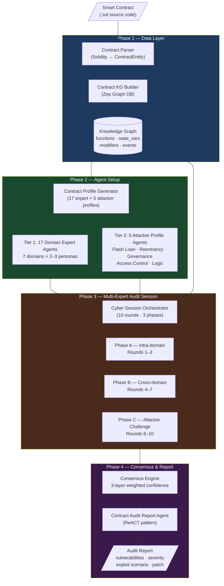
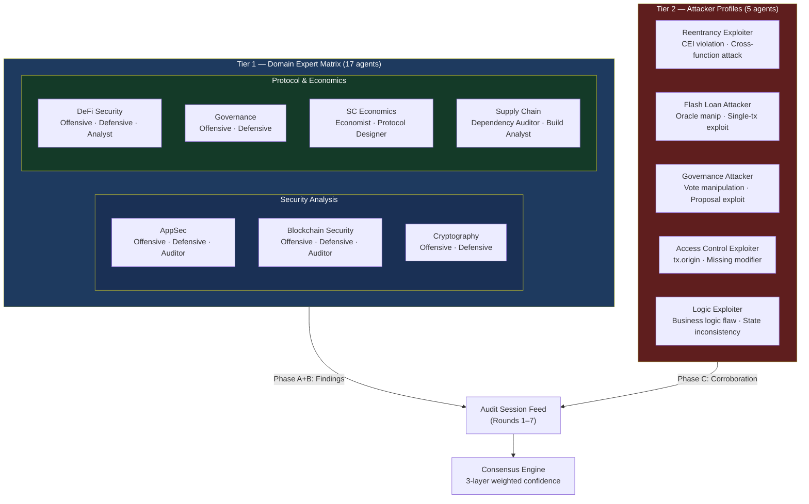
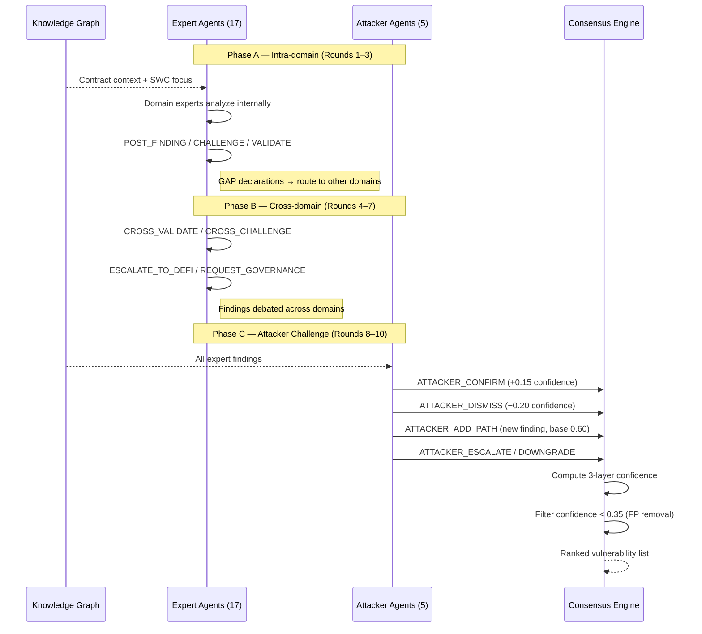
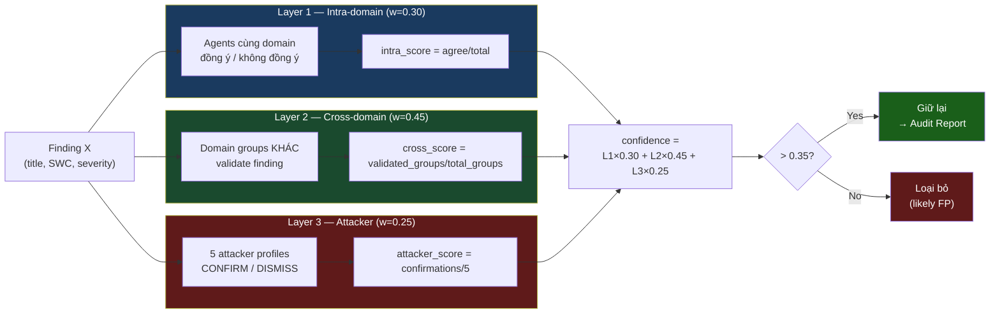
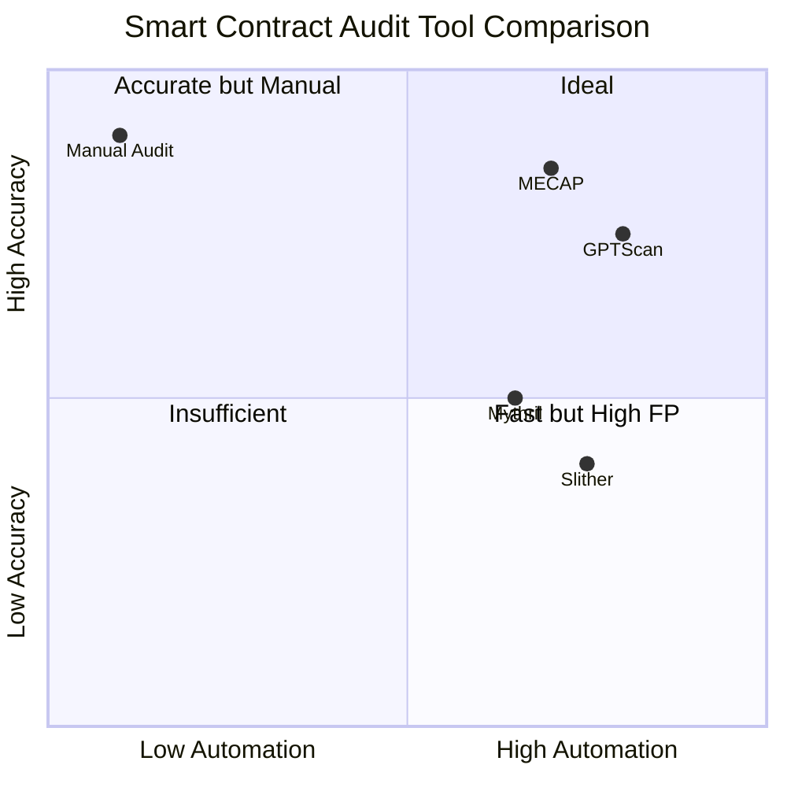

# Multi-Expert LLM Panel for Smart Contract Vulnerability Detection

**Đề tài**: Ứng dụng GenAI trong việc tự động phát hiện lỗ hổng logic và đề xuất bản vá cho Smart Contracts trên nền tảng Blockchain  

---

## Abstract

Smart contract là các chương trình bất biến được triển khai trên blockchain, quản lý trực tiếp tài sản tài chính. Các công cụ kiểm toán tự động hiện có — chủ yếu là phân tích tĩnh (Slither, Mythril) và hướng tiếp cận đơn LLM (GPTScan) — có tỷ lệ False Positive cao và khả năng phát hiện lỗ hổng ngữ nghĩa/logic nghiệp vụ hạn chế. Nghiên cứu này đề xuất **MECAP (Multi-Expert Contract Audit Panel)** — một framework đa tác nhân LLM mới, điều phối 22 agents chuyên biệt trên 7 lĩnh vực bảo mật để kiểm toán smart contract Solidity từ nhiều góc nhìn chuyên gia đồng thời. MECAP giới thiệu ba đóng góp chính: (1) cơ chế Knowledge Graph grounding gắn kết suy luận của agent với bằng chứng cụ thể trong contract, giảm hallucination; (2) phiên kiểm toán 3 pha (intra-domain → cross-domain → attacker challenge) thách thức và xác minh findings một cách có hệ thống; và (3) cơ chế đồng thuận 3 lớp có trọng số kết hợp sự đồng ý trong domain (w=0.30), xác nhận chéo giữa các domain (w=0.45), và corroboration từ attacker (w=0.25) để lọc False Positive. MECAP được đánh giá trên SmartBugs Curated — 143 contracts được gán nhãn thủ công qua 10 danh mục SWC — với mục tiêu Macro F1 ≥ 0.75, Precision ≥ 0.60 và Recall ≥ 0.80. Một ablation study qua 5 biến thể hệ thống (V1–V5) xác nhận độc lập từng đóng góp kiến trúc.

---

## 1. Bối cảnh và Động lực nghiên cứu

Smart contract là các chương trình tự thực thi trên blockchain — **không thể sửa sau khi deploy**, xử lý trực tiếp tài sản tài chính. Điều này khiến lỗ hổng bảo mật có hậu quả không thể đảo ngược:

| Vụ tấn công | Lỗ hổng | Thiệt hại |
|------------|---------|-----------|
| The DAO hack (2016) | Reentrancy (SWC-107) | **$60M** |
| Parity Multisig (2017) | Access control (SWC-115) | Đóng băng **$150M** |
| bZx Protocol (2020) | Flash loan + oracle manipulation | **$1M** |
| Ronin Bridge (2022) | Validator key compromise | **$625M** |
| Euler Finance (2023) | Logic lỗi DeFi lending | **$197M** |

Tổng thiệt hại từ DeFi hacks: **>$10 tỷ USD** từ 2016–2024 (DeFiLlama, 2024).

**Vấn đề với công cụ kiểm toán hiện tại:**

| Công cụ | Phương pháp | Hạn chế chính |
|---------|-------------|---------------|
| Slither (Feist et al., 2019) | Static analysis / pattern matching | False Positive cao; bỏ sót semantic flaw |
| Mythril (ConsenSys, 2018) | Symbolic execution | Chậm; path explosion; bỏ sót logic lỗi |
| Manticore / Echidna | Symbolic exec / Fuzzing | Không cover được DeFi-specific patterns |
| GPTScan (Sun et al., 2023) | AST + single LLM | F1=0.88 nhưng không đánh giá exploitability |
| Manual audit | Human expert | $50K–$200K/contract; không scale được |

**Research Gap:**  
Chưa có hệ thống nào kết hợp **(a)** đa góc nhìn chuyên môn song song, **(b)** cơ chế kiểm chứng khả năng khai thác (exploitability validation), và **(c)** grounding vào knowledge graph để giảm hallucination — trong một pipeline tự động thống nhất.

---

## 2. Phát biểu bài toán

### 2.1 Định nghĩa hình thức

Bài toán được phát biểu như sau: **cho đầu vào là một smart contract viết bằng Solidity, hệ thống cần trả về danh sách các lỗ hổng bảo mật được phát hiện** — mỗi lỗ hổng bao gồm:

| Thuộc tính | Ý nghĩa |
|-----------|---------|
| Tên/mô tả | Mô tả ngắn gọn bản chất lỗ hổng |
| Mã SWC | Phân loại theo SWC Registry (chuẩn quốc tế) |
| Mức độ nghiêm trọng | Critical / High / Medium / Low |
| Vị trí | Tên function và dòng code chứa lỗ hổng |
| Độ tin cậy | Điểm từ 0–1 do cơ chế đồng thuận tính toán |
| Đề xuất vá | Đoạn code Solidity gợi ý để khắc phục |

### 2.2 Tiêu chí thành công

Hệ thống được đánh giá trên tập SmartBugs Curated (143 contracts, 10 SWC categories) với ground truth gán nhãn thủ công. Để đạt yêu cầu, kết quả phải đồng thời thỏa mãn:

- **Macro F1 ≥ 0.75** — đo hiệu năng trung bình qua tất cả các contracts, không trọng số theo category
- **Precision ≥ 0.60** — kiểm soát tỷ lệ báo động nhầm (False Positive)
- **Recall ≥ 0.80** — đảm bảo không bỏ sót lỗ hổng thực sự

### 2.3 Giả thuyết nghiên cứu

> **H1**: Kiến trúc multi-agent với đa góc nhìn chuyên môn đạt Macro F1 cao hơn đáng kể so với single-agent approach trên cùng dataset.

> **H2**: Knowledge Graph grounding giảm tỷ lệ findings không có evidence (hallucination rate) so với phiên bản không có KG.

> **H3**: Attacker profiles cải thiện Precision thông qua việc loại bỏ các lỗ hổng không thực sự khai thác được.

---

## 3. Mục tiêu nghiên cứu

### 3.1 Mục tiêu tổng quát

Xây dựng hệ thống tự động phát hiện lỗ hổng logic và đề xuất bản vá cho smart contract trên nền tảng EVM, ứng dụng kiến trúc đa tác nhân LLM (Multi-Expert Panel) kết hợp Knowledge Graph để nâng cao độ chính xác và giảm tỷ lệ False Positive so với các công cụ hiện có.

### 3.2 Mục tiêu cụ thể

| # | Mục tiêu | Tiêu chí đánh giá |
|---|----------|-------------------|
| **MT1** | Xây dựng pipeline phân tích end-to-end: Solidity source → audit report | Pipeline hoàn chỉnh, chạy được trên SmartBugs dataset |
| **MT2** | Thiết kế cơ chế đồng thuận 3 lớp để lọc False Positive | Precision ≥ 0.60 trên SmartBugs Curated |
| **MT3** | Tích hợp 5 attacker profiles để xác nhận exploitability | Attacker profiles cải thiện F1 so với V3 (no attacker) |
| **MT4** | Đề xuất bản vá tự động cho các lỗ hổng được phát hiện | Patch suggestions áp dụng được vào source code |
| **MT5** | Đánh giá hệ thống trên SmartBugs Curated (143 contracts) | Macro F1 ≥ 0.75, vượt baseline Slither (F1=0.67) |

> **Tại sao baseline là Slither (F1=0.67) chứ không phải GPTScan (F1=0.88)?**
>
> GPTScan báo cáo F1=0.88 nhưng con số này được đo trên một **tập con tự chọn** — cụ thể là các "logic vulnerability" contracts mà GPTScan dùng template để lọc trước. Khi chỉ đánh giá trên những contracts phù hợp template của nó, kết quả tự nhiên cao hơn. Trong khi đó, **Slither F1=0.67 được đo trên toàn bộ SmartBugs Curated 143 contracts** — đúng dataset mà MECAP sẽ được đánh giá — tạo ra so sánh công bằng (apples-to-apples). Ngoài ra, MECAP nhắm đến phủ rộng nhiều SWC category (không chỉ logic bugs), nên mục tiêu F1 ≥ 0.75 vượt Slither trên cùng dataset là tiêu chí thực tế và có ý nghĩa học thuật.

### 3.3 Phạm vi nghiên cứu

- **Trong phạm vi**: Smart contract Solidity, EVM-compatible chains; phát hiện trước khi deploy (pre-deployment audit)
- **Ngoài phạm vi**: Bytecode đã deploy; non-EVM chains (Solana, Cardano); tự động deploy patch lên blockchain

---

## 4. Phạm vi nền tảng

### 4.1 Phân tích kiến trúc: Off-chain vs On-chain

Hệ thống chạy hoàn toàn **off-chain** — không deploy lên blockchain:

```
Input:   Solidity source code (.sol file)
          ↓
Process: Off-chain pipeline (Python + LLM + Knowledge Graph)
          ↓
Output:  Audit Report (.json / .md)
```

**Lý do chọn off-chain:** Smart contract sau khi deploy là immutable. Công cụ audit phải chạy **trước khi deploy** (pre-deployment), nằm ngoài blockchain. Chạy on-chain sẽ yêu cầu **gas fee** — phí giao dịch trả cho network để thực thi code trên blockchain; mỗi lần gọi hàm smart contract on-chain đều tiêu tốn ETH, không thực tế cho automated pipeline cần phân tích hàng trăm contracts liên tục.

### 4.2 Nền tảng Blockchain được hỗ trợ

> **EVM (Ethereum Virtual Machine)** là máy ảo thực thi code smart contract trên Ethereum và các blockchain tương thích. EVM định nghĩa bytecode format, instruction set, và mô hình thực thi — tất cả smart contract Solidity đều biên dịch xuống EVM bytecode. Các blockchain "EVM-compatible" chia sẻ cùng môi trường thực thi này, có nghĩa smart contract Solidity chạy giống hệt nhau trên Ethereum, BNB Chain, Polygon, v.v. mà không cần sửa code.

Phân tích Solidity source code → nhắm đến **EVM-compatible chains**:

| Blockchain | EVM | Solidity | Hỗ trợ |
|-----------|-----|----------|---------|
| Ethereum (Mainnet, Sepolia) | ✅ | ✅ | ✅ Primary target |
| BNB Smart Chain (BSC) | ✅ | ✅ | ✅ |
| Polygon (MATIC) | ✅ | ✅ | ✅ |
| Avalanche C-Chain | ✅ | ✅ | ✅ |
| Arbitrum / Optimism (L2) | ✅ | ✅ | ✅ |
| Solana | ❌ (SVM) | ❌ (Rust) | ❌ |
| Cardano | ❌ | ❌ (Plutus) | ❌ |
| Cosmos / NEAR | ❌ | ❌ (Rust/Go) | ❌ |

**Tại sao Solana, Cardano, Cosmos không được hỗ trợ?**

Các nền tảng non-EVM không tương thích với hệ thống ở **3 lớp cơ bản**:

1. **Ngôn ngữ lập trình khác hoàn toàn**: Solana dùng Rust, Cardano dùng Plutus (Haskell), Cosmos dùng Rust/Go — không phải Solidity. Parser của MECAP được xây dựng cho Solidity AST, không thể đọc được code Rust hay Plutus.

2. **Mô hình lỗ hổng không áp dụng được**: SWC Registry (bộ taxonomy lỗ hổng mà MECAP dùng) chỉ định nghĩa lỗ hổng cho EVM/Solidity. Reentrancy (SWC-107), tx.origin (SWC-115)... là khái niệm đặc thù EVM — không tồn tại trên Solana hay Cardano vì họ có execution model hoàn toàn khác.

3. **Dataset đánh giá (SmartBugs Curated) là 100% Solidity contracts**: Không có benchmark tương đương cho Rust/Plutus-based smart contracts.

**Hướng mở rộng:** Hỗ trợ non-EVM chains đòi hỏi xây dựng lại toàn bộ parser, định nghĩa vulnerability taxonomy riêng, và có dataset labeled mới — ngoài phạm vi luận án này.

---

## 5. Ý tưởng cốt lõi

**MECAP — Multi-Expert Contract Audit Panel** (Hội đồng Kiểm toán Hợp đồng Đa Chuyên gia) — Áp dụng kiến trúc hội đồng đa chuyên gia LLM để phân tích smart contract từ nhiều góc nhìn song song, sau đó dùng cơ chế đồng thuận 3 lớp để lọc False Positive và xếp hạng lỗ hổng.

- **Multi-Expert**: 22 agents với vai trò chuyên biệt (AppSec, DeFi Security, Cryptography, Governance, Attacker...) — không ai nhìn contract từ một góc duy nhất
- **Contract Audit**: kiểm toán toàn diện smart contract, từ lỗi code-level đến lỗ hổng logic nghiệp vụ
- **Panel**: hội đồng tranh luận — các experts challenge, validate, và phản biện lẫn nhau qua 3 phase và 10 rounds

```
Nguồn cảm hứng (MiroFish — mô phỏng xã hội):
  Multi-agent LLM → Mô phỏng lan truyền thông tin trên mạng xã hội
                     ↕ transfer kiến trúc multi-agent
Ứng dụng vào smart contract audit:
  Multi-agent LLM → Phân tích lỗ hổng từ đa góc nhìn chuyên môn
```

**Điểm khác biệt then chốt:**

| Yếu tố | Công cụ hiện có | MECAP |
|--------|----------------|-------|
| Số góc nhìn | 1 (single tool/LLM) | 22 agents × 7 domains |
| Knowledge grounding | Không | Zep KG với contract entities |
| Exploitability check | Không (GPTScan) | 5 attacker profiles |
| Consensus mechanism | LLM threshold / rule | 3-layer weighted voting |
| DeFi coverage | Hạn chế | DeFi domain group chuyên biệt |

**Novelty statement:**
> *To the best of our knowledge, MECAP is the first framework to apply structured multi-domain agent debate with Knowledge Graph grounding and attacker-perspective corroboration specifically to smart contract vulnerability detection.*

---

## 6. Cơ sở lý thuyết

### 6.1 Các khái niệm nền tảng

#### Large Language Model (LLM)
LLM là mô hình ngôn ngữ dựa trên kiến trúc **Transformer** (Vaswani et al., 2017), được huấn luyện trên corpus văn bản khổng lồ qua self-supervised learning. Các khả năng quan trọng:

| Khả năng | Mô tả | Ứng dụng trong MECAP |
|---------|-------|---------------------|
| **In-context learning** | Học từ few-shot examples trong prompt | Agent nhận diện SWC pattern qua examples |
| **Instruction following** | Thực hiện tác vụ theo mô tả ngôn ngữ tự nhiên | System prompt định nghĩa expert role |
| **Code generation/analysis** | Hiểu và sinh Solidity code | Phân tích source code, đề xuất patch |
| **Chain-of-Thought** | Suy luận từng bước có giải thích | Agents trình bày reasoning cho mỗi finding |

Mô hình sử dụng: **Google Gemini 2.5 Flash** (Vertex AI) — long context 1M tokens, cost-effective, strong code analysis.

#### Prompt Engineering
Kỹ thuật thiết kế đầu vào để định hướng hành vi LLM:

- **System prompt**: Định nghĩa vai trò, kiến thức miền, format output cố định
- **Role-playing**: Gán nhân vật chuyên gia để kích hoạt domain knowledge
- **Structured output**: Yêu cầu JSON schema cụ thể để parse findings tự động
- **Context injection**: Inject relevant KG nodes vào prompt trước khi agent phân tích

#### Retrieval-Augmented Generation (RAG)
Kỹ thuật kết hợp LLM với external knowledge base — agent query knowledge graph trước khi sinh response. Giảm hallucination và tăng factual accuracy (Lewis et al., 2020). MECAP áp dụng RAG bằng cách inject KG context (functions, state variables, call graph) vào mỗi agent prompt.

### 6.2 Smart Contract và SWC Registry

**Smart Contract Weakness Classification (SWC) Registry** — taxonomy chuẩn gồm 40 loại lỗ hổng (tương tự CWE cho software security):

| SWC ID | Tên | Ví dụ thực tế |
|--------|-----|---------------|
| SWC-107 | Reentrancy | The DAO hack — $60M |
| SWC-101 | Integer Overflow/Underflow | BEC Token — $900M |
| SWC-115 | Authorization via tx.origin | Phishing attack vector |
| SWC-116 | Block Timestamp Manipulation | Lottery/randomness exploit |
| SWC-120 | Weak Randomness | On-chain PRNG games |
| SWC-132 | Unexpected ETH via Selfdestruct | Invariant violation |

**DeFi-specific attack patterns** (ngoài SWC Registry):

| Pattern | Cơ chế | Điều kiện xuất hiện |
|---------|--------|---------------------|
| Flash Loan Attack | Vay không cần tài sản đảm bảo trong 1 tx | AMM pool + oracle phụ thuộc spot price |
| Price Oracle Manipulation | Thao túng AMM pool → giá sai → liquidation | Contract dùng DEX price làm oracle |
| Governance Attack | Vay token governance → vote proposal độc hại | Governance không có timelock |
| Sandwich Attack | Front-run và back-run giao dịch lớn trên DEX | MEV-enabled environment |

### 6.3 Multi-Agent LLM Systems

**Emergent behavior trong multi-agent debate**: Khi nhiều agents với góc nhìn khác nhau challenge và validate lẫn nhau, độ chính xác tổng hợp vượt bất kỳ agent đơn lẻ nào — được chứng minh bởi:

- **Society of Mind** (Minsky, 1986): Intelligence emerges from interaction of simple agents
- **LLM Debate** (Du et al., 2023): Multi-agent debate cải thiện factual accuracy +15% vs single-agent
- **AgentVerse** (Chen et al., 2023): Adversarial agent roles cải thiện solution quality

**Phân biệt với single-agent approaches:**

```
GPTScan (single-agent):          MECAP (multi-agent):
  1 LLM call                       22 agents × 10 rounds
  1 góc nhìn                       7 domains × 3 phases
  Không debate                     Challenge + validate
  Không exploitability             Attacker corroboration
```

#### OASIS và kiến trúc nền tảng của MECAP

**OASIS** (Yang et al., 2024) là framework mô phỏng mạng xã hội đa tác nhân xây dựng trên CAMEL-AI. Trong OASIS, mỗi agent đại diện một user mạng xã hội với profile riêng (tính cách, hành vi, quan điểm), tương tác qua shared action bus theo vòng lặp có cấu trúc — mô phỏng cách thông tin lan truyền và hình thành đồng thuận trong cộng đồng.

**MiroFish** là hệ thống fork OASIS, ứng dụng cho bài toán dự đoán lan truyền thông tin và mô phỏng hành vi xã hội. MECAP là bước transfer kiến trúc này sang security domain — thay vì mô phỏng xã hội, các agents đóng vai chuyên gia bảo mật tranh luận về lỗ hổng.

| Yếu tố kiến trúc | OASIS (social simulation) | MECAP (security audit) |
|-----------------|--------------------------|------------------------|
| Agent persona | User profile (tính cách, quan điểm) | Expert profile (domain, attack style) |
| Interaction model | Post / React / Comment trên social feed | POST_FINDING / CHALLENGE / VALIDATE trong audit session |
| Consensus mechanism | Thông tin được lan truyền nếu đủ engagement | Lỗ hổng được giữ lại nếu đủ cross-domain validation |
| Structured rounds | Turn-based simulation rounds | 3-phase, 10-round audit session |
| Shared state | Social feed (posts, reactions) | Audit session feed (findings, challenges) |

**Giá trị của domain transfer này:** MECAP không xây dựng multi-agent framework từ đầu — nó kế thừa một kiến trúc đã được validate trên bài toán social dynamics, nơi cơ chế debate và hình thành đồng thuận giữa các agents đã được chứng minh hoạt động. Việc mapping thành công từ social simulation sang security audit cho thấy kiến trúc dạng này có tính tổng quát cao, không bị giới hạn trong một domain cụ thể — đây là đóng góp học thuật bổ sung bên cạnh các đóng góp kỹ thuật chính của MECAP.

### 6.4 Knowledge Graph cho Agent Grounding

**Vấn đề hallucination**: LLM agents có thể sinh findings không có cơ sở trong source code.

**Giải pháp — Contract Knowledge Graph:**

```
Solidity source → Parser → Extract entities → Zep Graph DB

Entities:  functions, state_variables, modifiers, events, external_calls
Relations: CALLS, MODIFIES_STATE, READS_STATE, INHERITS, EMITS, EXTERNAL_CALL_TO
```

Agents query KG khi cần evidence → findings phải có anchor cụ thể (function name, line number, state variable) → có thể kiểm chứng độc lập. Đây là ứng dụng RAG (Lewis et al., 2020) vào security domain.

### 6.5 Consensus Mechanism

**3-layer weighted confidence** (tương tự voting ensemble trong ML — Dietterich, 2000):

```
Layer 1 — Intra-domain agreement   (weight = 0.30)
  score = agree_agents / total_agents_in_domain

Layer 2 — Cross-domain validation  (weight = 0.45)  ← highest weight
  score = validated_domain_groups / total_domain_groups
  [ngăn group bias: 1 domain không thể tự validate mình]

Layer 3 — Attacker corroboration   (weight = 0.25)
  score = attacker_confirmations / 5

confidence_final = L1×0.30 + L2×0.45 + L3×0.25
threshold = 0.35  →  confidence < 0.35: loại bỏ (likely FP)
```

**Căn cứ chọn trọng số:**

| Layer | Weight | Lý do |
|-------|--------|-------|
| Cross-domain | 0.45 | Independent validation từ domain khác — bằng chứng mạnh nhất, không bị group bias |
| Intra-domain | 0.30 | Expert consensus trong domain — cần thiết nhưng có thể bị confirmation bias |
| Attacker | 0.25 | Xác nhận exploitability quan trọng nhưng chỉ là tie-breaker, không tự quyết định |

---

## 7. Kiến trúc hệ thống

### 7.1 Pipeline tổng thể



### 7.2 Cấu trúc Agent (22 agents)



### 7.3 Luồng 3-phase session



### 7.4 Cơ chế đồng thuận 3 lớp



### 7.5 Technology Stack

| Layer | Công nghệ | Lý do chọn |
|-------|-----------|------------|
| LLM Backend | Google Gemini 2.5 Flash (Vertex AI) | Long context 1M tokens, cost-effective, strong code analysis |
| Agent Framework | CAMEL-AI / OASIS (fork) | Multi-agent social simulation, adapted cho security domain |
| Knowledge Graph | Zep Cloud (vector + graph DB) | Entity memory + relationship tracking, RAG-ready |
| Contract Parser | Solidity AST (solc + slither) | Mature parser, extract functions/state vars/modifiers |
| Backend | Python + Flask | Rich ML ecosystem, rapid prototyping |
| Evaluation Dataset | SmartBugs Curated | Industry-standard, 143 labeled contracts, 10 SWC categories |

---

## 8. Công trình liên quan

### 8.1 Static Analysis Tools

**Slither** (Feist et al., 2019) là static analyzer phổ biến nhất cho Solidity, sử dụng data flow analysis và taint tracking. Đạt F1≈0.67 trên SmartBugs Curated nhưng bỏ sót lỗi logic phức tạp không biểu hiện qua pattern đơn giản.

**Mythril** (Mueller, ConsenSys, 2018) dùng symbolic execution và SMT solving, cho phép deep path analysis nhưng bị path explosion với contracts lớn. Runtime có thể lên tới hàng giờ cho complex contracts.

**Khoảng cách:** Static tools không có semantic understanding về business intent — không thể phát hiện logic flaws như oracle manipulation hay governance attacks.

### 8.2 LLM-based Approaches

**GPTScan** (Sun et al., 2023) kết hợp GPT-4 với static AST analysis, matching logic vulnerabilities với pre-defined templates. Precision=0.91, Recall=0.86, F1=0.88 trên logic vulnerabilities. Tuy nhiên GPTScan: (1) chỉ dùng 1 LLM call, (2) không kiểm tra exploitability, (3) phụ thuộc template cố định.

**AuditGPT** (Zhou et al., 2024) fine-tune LLM trên audit report corpus. Cải thiện recall nhưng vẫn single-perspective, không có cross-domain debate.

**SmartInv** (Wang et al., 2024) dùng LLM để synthesize contract invariants và kiểm tra vi phạm. Complementary approach với MECAP (invariant-based vs. vulnerability-focused).

**Khoảng cách:** Tất cả LLM-based approaches hiện tại đều single-perspective, không có multi-domain debate hay exploitability validation.

### 8.3 Multi-Agent Systems

**CAMEL** (Li et al., 2023) giới thiệu role-playing framework cho LLM agents — two-agent architecture (AI User + AI Assistant) cho collaborative task solving. MECAP mở rộng sang 22-agent, multi-domain, adversarial debate.

**AgentVerse** (Chen et al., 2023) đề xuất multi-agent collaborative problem-solving với dynamic team composition. MECAP áp dụng insight về adversarial agents (attacker profiles) để cải thiện consensus.

**LLM Debate** (Du et al., 2023): Multi-agent debate cải thiện factual accuracy — lý thuyết nền tảng cho Phase B (cross-domain debate) của MECAP.

### 8.4 Dataset và Benchmark

**SmartBugs** (Durieux et al., 2020) cung cấp framework đánh giá tools và **SmartBugs Curated** — 143 contracts được gán nhãn thủ công theo SWC. Đây là benchmark chuẩn được sử dụng rộng rãi nhất, cho phép so sánh trực tiếp với Slither, Mythril, GPTScan.

### 8.5 Tổng hợp so sánh



| Tiêu chí | Slither | GPTScan | Manual Audit | **MECAP** |
|----------|---------|---------|--------------|-----------|
| Phương pháp | Static analysis | AST + 1 LLM | Human expert | Multi-agent LLM + KG |
| Số góc nhìn | 1 | 1 | 1–3 | 22 (17 expert + 5 attacker) |
| Exploitability check | Không | Không | Có | Có (attacker profiles) |
| FP reduction | Rule threshold | LLM filter | Human judgment | 3-layer consensus |
| DeFi logic coverage | Hạn chế | Trung bình | Tốt | Tốt (DeFi domain group) |
| Chi phí / contract | ~$0 | ~$0.10 | $50K–$200K | ~$1–5 |
| F1 (SmartBugs Reentrancy) | 0.67 | 0.88* | — | *đang đánh giá* |

*GPTScan F1=0.88 đo trên tập con logic vulnerabilities, không phải toàn bộ SmartBugs Curated.*

---

## 9. Đóng góp khoa học

| ID | Đóng góp | Chi tiết |
|----|----------|----------|
| **C1** | **Kiến trúc mới — MECAP** | First multi-domain, multi-persona agent panel for smart contract audit. Khác biệt với GPTScan (single LLM) và CAMEL (two-agent) |
| **C2** | **KG Grounding** | Contract Knowledge Graph anchors agent reasoning → findings có evidence cụ thể (function name, line number) → giảm hallucination đo được |
| **C3** | **Exploitability Validation** | Attacker profiles phân biệt "lỗ hổng tồn tại" vs "thực sự khai thác được" — không có trong bất kỳ automated tool nào hiện tại |
| **C4** | **FP Reduction** | 3-layer consensus (intra + cross-domain + attacker) lọc False Positive hiệu quả hơn single-LLM threshold hay rule-based filter |
| **C5** | **DeFi Coverage** | Phát hiện lỗi logic DeFi (flash loan, oracle manipulation, governance attack) — bị bỏ sót bởi static analysis do thiếu semantic understanding |

---

## 10. Thiết kế thực nghiệm

### 10.1 Dataset

**Tại sao cần 2 dataset?** SmartBugs Curated cung cấp comparison baseline với các tools hiện có, nhưng contracts nhỏ (median 42 dòng), single-vulnerability, và không đại diện cho production code. Real-world evaluation trên DeFiHackLabs bổ sung bằng chứng generalizability — đây là yêu cầu thực tế để publish ở top venue.

#### Dataset 1 — SmartBugs Curated (primary benchmark)

143 contracts được gán nhãn thủ công theo SWC, dùng để **so sánh trực tiếp với Slither/Mythril/GPTScan**:

| SWC Category | Contracts | Phase đánh giá |
|-------------|----------|----------------|
| SWC-107 Reentrancy | 31 | ✅ Phase 5b (đang chạy) |
| SWC-101 Integer Overflow | 21 | Phase 5c |
| SWC-115 tx.origin | 17 | Phase 5c |
| SWC-116 Timestamp | 10 | Phase 5c |
| SWC-120 Weak Randomness | 8 | Phase 5c |
| Các SWC khác (5 categories) | 56 | Phase 5c |

**Giới hạn đã biết**: median 42 dòng/contract, 100% single-vulnerability, contracts synthetic — không đủ để chứng minh hiệu quả trên production code.

#### Dataset 2 — DeFiHackLabs Real-World Subset (generalizability evaluation)

15–20 contracts từ **DeFiHackLabs** — kho lưu trữ các vụ hack DeFi thực tế có PoC exploit:

| Đặc điểm | DeFiHackLabs | SmartBugs Curated |
|---------|-------------|-----------------|
| Nguồn gốc | Production contracts đã bị hack | Synthetic/toy contracts |
| Kích thước | 300–3000+ dòng | 14–2470 dòng (median 42) |
| Vulnerability | Multi-vul, logic phức tạp | Single-vul, pattern rõ ràng |
| Ground truth | PoC exploit = confirmed | Gán nhãn thủ công |
| Mục đích | Generalizability proof | Baseline comparison |

**Lý do chọn DeFiHackLabs thay vì Web3Bugs**: PoC exploit có sẵn → ground truth không ambiguous; focus vào DeFi-specific attacks phù hợp với điểm mạnh của MECAP (DeFi domain group).

**Lựa chọn contracts**: Ưu tiên các vụ hack có SWC tương ứng (Reentrancy, Oracle Manipulation, Access Control) để có thể map với SWC Registry.

### 10.2 Evaluation Metrics

| Metric | Cách tính | Ý nghĩa |
|--------|-----------|---------|
| Precision | TP / (TP + FP) | Tỷ lệ findings đúng trong tổng số findings được báo cáo |
| Recall | TP / (TP + FN) | Tỷ lệ lỗ hổng thực được phát hiện |
| F1-score | 2 × P × R / (P + R) | Trung bình điều hòa giữa Precision và Recall |
| Macro F1 | Trung bình F1 không trọng số qua N contracts | Đánh giá công bằng không thiên về contract phổ biến |
| Hallucination Rate | Số findings không có KG anchor / tổng số findings | Đo chất lượng KG grounding (RQ4) |

**Pass criteria:**

| Phase | Dataset | Macro F1 | Precision | Recall |
|-------|---------|----------|-----------|--------|
| Phase 5b | SmartBugs SWC-107 (31) | ≥ 0.75 | ≥ 0.60 | ≥ 0.80 |
| Phase 5c | SmartBugs full (143) | ≥ 0.75 | ≥ 0.60 | ≥ 0.80 |
| Phase 5d | DeFiHackLabs (15–20) | ≥ 0.60 | ≥ 0.50 | ≥ 0.70 |

*Phase 5d target thấp hơn vì contracts phức tạp hơn đáng kể — đây là generalizability check, không phải benchmark chính.*

### 10.3 Ablation Study

| Variant | Thành phần bỏ | Hypothesis kiểm chứng |
|---------|--------------|----------------------|
| **V1** — Full system | — (baseline đề xuất) | — |
| **V2** — No KG | Bỏ Knowledge Graph, chỉ dùng source code text | H2: KG giảm hallucination |
| **V3** — No Attacker | Bỏ Tier 2 (5 attacker profiles) | H3: Attacker improves Precision |
| **V4** — No Cross-domain | Chỉ Phase A (intra-domain), bỏ Phase B | H1: Cross-domain debate cần thiết |
| **V5** — Single Agent | 1 LLM call duy nhất (GPTScan-style) | H1: Multi-agent > single-agent |

### 10.4 Research Questions

| RQ | Câu hỏi | Phương pháp | Variant |
|----|---------|-------------|---------|
| **RQ1** | Multi-agent có phát hiện đa dạng hơn single-agent? | F1 per SWC category | V1 vs V5 |
| **RQ2** | 3-layer consensus có giảm FP rate? | Precision comparison | V1 vs V5 |
| **RQ3** | Attacker profiles cải thiện DeFi vulnerability detection? | F1 trên DeFi contracts | V1 vs V3 |
| **RQ4** | KG grounding giảm hallucination? | % findings có function/line anchor | V1 vs V2 |

### 10.5 Baseline Comparison Protocol

Tất cả tools chạy trên cùng SmartBugs Curated dataset, cùng ground truth labels:

| Tool | Version | Configuration | Notes |
|------|---------|---------------|-------|
| Slither | 0.10.x | Default detectors, all severity | SmartBugs automated runner |
| Mythril | 0.24.x | Timeout 300s/contract | SmartBugs automated runner |
| GPTScan | v1 (2023 paper) | Default templates | Reproduce từ paper |
| **MECAP V1** | Current | 22 agents, 10 rounds, threshold=0.35 | Đề xuất — full system |
| **MECAP V5** | Ablation | 1 agent, 1 round | Single-agent baseline |

---

## 11. Kết quả kỳ vọng

| Metric | Slither | Mythril | GPTScan* | **MECAP V1 (kỳ vọng)** |
|--------|---------|---------|---------|------------------------|
| Macro F1 | 0.67 | ~0.60 | 0.88* | **≥ 0.80** |
| Precision | ~0.60 | ~0.55 | ~0.91 | **≥ 0.60** |
| Recall | ~0.75 | ~0.65 | ~0.86 | **≥ 0.80** |
| DeFi coverage | Thấp | Thấp | Trung bình | **Cao** |
| Exploitability info | Không | Không | Không | **Có** |
| Patch suggestion | Không | Không | Không | **Có** |

*GPTScan F1=0.88 đo trên tập con logic vulnerabilities, không phải toàn bộ SmartBugs Curated 143 contracts.*

**Ablation expectations:**

| Variant | Dự đoán so với V1 |
|---------|------------------|
| V2 (no KG) | Hallucination rate tăng ~20–30%; F1 giảm nhẹ |
| V3 (no attacker) | FP tăng; Precision giảm ~10–15% |
| V4 (no cross-domain) | Recall giảm; bỏ sót nhiều edge cases |
| V5 (single agent) | F1 thấp hơn đáng kể, đặc biệt với DeFi contracts |

---

## 12. Threats to Validity

### 12.1 Internal Validity

| Mối đe dọa | Mô tả | Mitigation |
|-----------|-------|------------|
| **LLM non-determinism** | Temperature > 0 → kết quả khác nhau giữa các lần chạy | Chạy mỗi contract 3 lần, báo cáo mean ± std |
| **Prompt sensitivity** | Thay đổi nhỏ trong system prompt → findings thay đổi | Version control prompts; reproducibility check trên 10 contracts |
| **Consensus threshold bias** | Ngưỡng 0.35 được chọn empirically | Ablation trên threshold: {0.25, 0.35, 0.45, 0.55} |
| **Weight calibration** | Trọng số 0.30/0.45/0.25 chưa tối ưu hóa | Grid search trên SWC-107 validation set |

### 12.2 External Validity

| Mối đe dọa | Mô tả | Mitigation |
|-----------|-------|------------|
| **Dataset size** | SmartBugs Curated 143 contracts — nhỏ, median 42 dòng | Phase 5d bổ sung 15–20 production contracts từ DeFiHackLabs |
| **SWC distribution bias** | Dataset tập trung vào một số SWC nhất định | Báo cáo per-category results riêng biệt |
| **Solidity version** | Nhiều contracts là Solidity 0.4.x–0.5.x — cũ | Phân tích performance theo Solidity version |
| **LLM model dependency** | Kết quả phụ thuộc Gemini 2.5 Flash | Test thêm với GPT-4o để assess model generalizability |
| **DeFi pattern evolution** | Attack patterns mới liên tục xuất hiện | Ghi rõ temporal scope; SmartBugs snapshot tháng 2020 |

### 12.3 Construct Validity

| Mối đe dọa | Mô tả | Mitigation |
|-----------|-------|------------|
| **Ground truth quality** | SmartBugs labels có thể có labeling errors | Cross-validate với 2 independent experts cho subset 20 contracts |
| **Severity-agnostic F1** | Macro F1 không phân biệt Critical vs Low | Báo cáo thêm Weighted F1 theo severity |
| **Matching criteria** | Finding khớp SWC nhưng sai location → TP hay FP? | Định nghĩa rõ: TP = SWC match + function-level location match |

---

## 13. Hướng mở rộng

1. **Incremental audit**: Chỉ re-audit functions bị thay đổi khi contract upgrade — giảm cost từ ~$3/audit xuống ~$0.5
2. **Cross-contract analysis**: Phát hiện lỗ hổng chỉ xuất hiện khi nhiều contracts tương tác (composability risks trong DeFi)
3. **Automated PoC generation**: Agents tự viết PoC exploit bằng Foundry/Hardhat để xác nhận exploitability thực tế
4. **Real-time monitoring**: Áp dụng pipeline cho bytecode deployed contracts (decompile + audit)
5. **Non-EVM extension**: Hỗ trợ Rust-based chains (Solana, NEAR) với parser riêng và Move/Rust-specific vulnerability patterns
6. **CI/CD integration**: Plugin cho GitHub Actions — tự động audit mỗi khi có commit thay đổi .sol file

